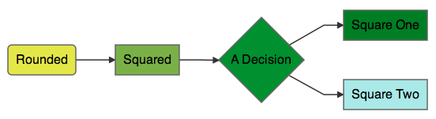
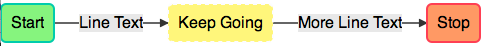
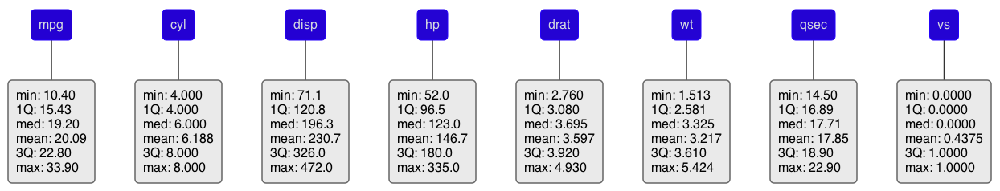

`DiagrammeR`
==========

Create diagrams using R, with a light interface to the [`mermaid.js` library](https://github.com/knsv/mermaid). This library works by using markdown-like text to describe a diagram. By doing this in R, we can also add some R code into the mix and integrate these diagrams in `R Console`, `R Markdown`, and `shiny` apps.

### Installation

Install `DiagrammeR` from GitHub using the `devtools` package.

```R
require(devtools)
install_github('rich-iannone/DiagrammeR')
```

### Introduction

The package really only has one function `DiagrammeR` which leverages the infrastructure provided by [`htmlwidgets`](http://htmlwidgets.org) to bridge `R` and `mermaid.js`. All lines are terminated with a semicolon. The line `graph LR;` indicates that a graph running left to right is desired. Nodes are arbitrarily named and arrows such as `-->` indicate the type of arrow connection. The `DiagrammeR` function currently takes three arguments.

Argument    |     Description
----------  | -------------------------------
diagram     | the spec of the diagram or can also be blank if using `htmltools::tags`
width       | `NULL` (default) or a specified width as a number (in pixels)
height      | `NULL` (default) or a specified height as a number (in pixels)


### A Few Usage Examples

Below are a few examples of how we might use `DiagrammeR`.  For more examples and additional documentation, see the [`mermaid.js` Wiki](https://github.com/knsv/mermaid/wiki).

```R
# like html, whitespace does not matter in the diagram spec
diagram <- "
graph LR;
  A-->B;
  A-->C;
  C-->E;
  B-->D;
  C-->D;
  D-->F;
  E-->F;
"

DiagrammeR(diagram, height = 400)
```

This renders the following image:


Alternatively, you could have the diagram flowing from top to bottom by using the statement `graph TB` in place of `graph LR`. Here is the result of that:


Alright, here's another example. This one places some text inside the diagram objects. Also, there are some CSS styles to add a color fill to each of the diagram objects:

```R
diagram <- "
graph LR;
A(Rounded)-->B[Squared];
B-->C{A Decision};
C-->D[Square One];
C-->E[Square Two];
    
style A fill:#E5E25F;
style B fill:#87AB51;
style C fill:#3C8937;
style D fill:#23772C;
style E fill:#B6E6E6;
"
    
DiagrammeR(diagram, height = 200)
```

What you get is this:



Here's an example with line text (that is, text appearing on connecting lines). Simply place text between pipe characters, just after the arrow, right before the node identifier. There are few more CSS properties for the boxes included in this example (`stroke`, `stroke-width`, and `stroke-dasharray`).

```R
diagram <- "
graph LR;
A(Start)-->|Line Text|B(Keep Going)
B-->|More Line Text|C(Stop);
    
style A fill:#A2EB86, stroke:#04C4AB, stroke-width:2px;
style B fill:#FFF289, stroke:#FCFCFF, stroke-width:2px, stroke-dasharray: 4, 4;
style C fill:#FFA070, stroke:#FF5E5E, stroke-width:2px;
"

DiagrammeR(diagram, height = 200)
```

The resultant graphic:



Let's include the values of some R objects into a fresh diagram. The `mtcars` dataset is something I go to again and again so I'm going to load it up.

```R
data(mtcars)
```

When you call the R `summary` function on this data frame, you obtain this:

```
     mpg             cyl             disp             hp             drat      
 Min.   :10.40   Min.   :4.000   Min.   : 71.1   Min.   : 52.0   Min.   :2.760  
 1st Qu.:15.43   1st Qu.:4.000   1st Qu.:120.8   1st Qu.: 96.5   1st Qu.:3.080  
 Median :19.20   Median :6.000   Median :196.3   Median :123.0   Median :3.695  
 Mean   :20.09   Mean   :6.188   Mean   :230.7   Mean   :146.7   Mean   :3.597  
 3rd Qu.:22.80   3rd Qu.:8.000   3rd Qu.:326.0   3rd Qu.:180.0   3rd Qu.:3.920  
 Max.   :33.90   Max.   :8.000   Max.   :472.0   Max.   :335.0   Max.   :4.930  
       wt             qsec             vs               am              gear      
 Min.   :1.513   Min.   :14.50   Min.   :0.0000   Min.   :0.0000   Min.   :3.000  
 1st Qu.:2.581   1st Qu.:16.89   1st Qu.:0.0000   1st Qu.:0.0000   1st Qu.:3.000  
 Median :3.325   Median :17.71   Median :0.0000   Median :0.0000   Median :4.000  
 Mean   :3.217   Mean   :17.85   Mean   :0.4375   Mean   :0.4062   Mean   :3.688  
 3rd Qu.:3.610   3rd Qu.:18.90   3rd Qu.:1.0000   3rd Qu.:1.0000   3rd Qu.:4.000  
 Max.   :5.424   Max.   :22.90   Max.   :1.0000   Max.   :1.0000   Max.   :5.000  
      carb      
 Min.   :1.000  
 1st Qu.:2.000  
 Median :2.000  
 Mean   :2.812  
 3rd Qu.:4.000  
 Max.   :8.000 
```

That information can placed into a diagram. First, we'll get a vector object for strings that specify each of the connections and the text inside the boxes (one for each `mtcars` dataset column). These strings will contain each of the statistics provided by the `summary` function (minimum, 1st quartile, median, mean, 3rd quartile, and maximum). We'll use a `sapply` to loop through each column.

```R
connections <- sapply(
  1:ncol(mtcars)
  , function(i){
    paste0(
      i
      , "(", colnames(mtcars)[i], ")---"
      , i, "-stats("
      , paste0(
        names(summary(mtcars[,i]))
        , ": "
        , unname(summary(mtcars[,i]))
        , collapse="<br/>"
      )
      , ")"
    )
  }
)
``` 

This generates all of the syntax required for connections between column names to the statistical summary text in each of the adjoining boxes. Notice the use of the `<br/>` tag that terminates each of the stats inside the `paste0` statement. They provide the necessary linebreaks for text within each diagram object.

Now, to generate the code for the summary diagram, one can use a `paste0` statement and then a separate `paste` statement for the connection text (with the `collapse` argument set to `\n` to specify a linebreak for the output text). Note that within the `paste0` statement, there is a `\n` linebreak wherever you would need one. Finally, to style multiple objects a `classDef` statement was used. Here, a class of type `column` was provided with values for certain CSS properties. On the final line, the `class` statement applied the class definition to nodes 1 through 11 (a comma-separated list generated by the `paste0` statement). 

```R
diagram <-
paste0(
"graph TD;", "\n",
paste(connections, collapse = "\n"), "\n",
"classDef column fill:#0001CC, stroke:#0D3FF3, stroke-width:1px;" ,"\n",
"class ", paste0(1:length(connections), collapse = ","), " column;
")

DiagrammeR(diagram)
```

This is part of the resulting graphic (it's quite wide so I'm displaying just 8 of the 11 columns):



### DiagrammeR + shiny

As with other `htmlwidgets`, we can easily dynamically bind `DiagrammeR` in `R` with `shiny`. Here is a quick example where we can provide a diagram spec in a `textInput`.

```R
library(shiny)

ui = shinyUI(fluidPage(
  textInput('spec', 'Diagram Spec', value = ""),
  DiagrammeROutput('diagram')
))

server = function(input, output){
  output$diagram <- renderDiagrammeR(DiagrammeR(
    input$spec
  ))
}

shinyApp( ui = ui, server = server )
```
