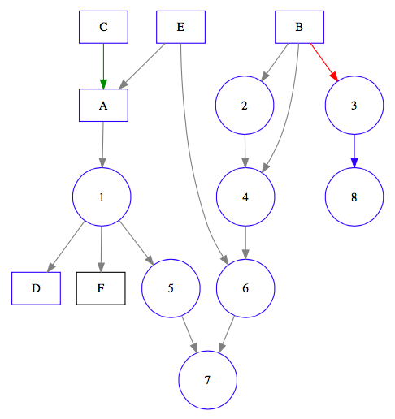
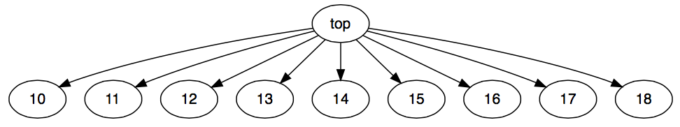
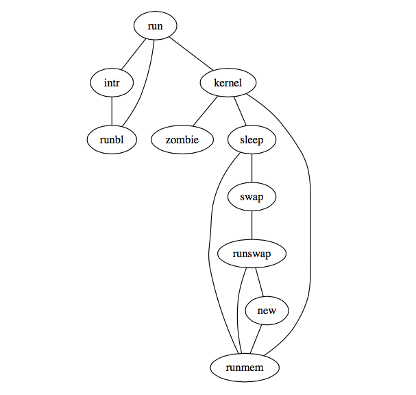
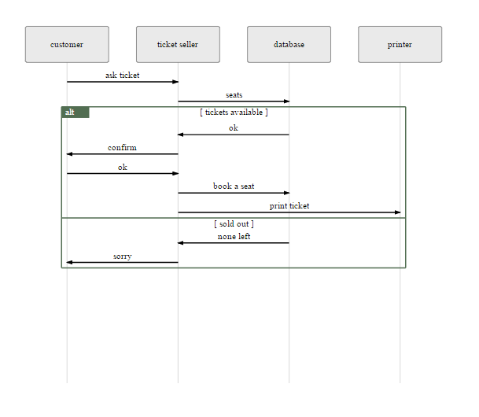

With the **DiagrammeR** package, you can create diagrams and flowcharts using **R**. Markdown-like text is used to describe a diagram and, by doing this in **R**, we can also add some **R** code into the mix and integrate these diagrams in the **R** console, through **R Markdown**, and in **shiny** apps. 

Want a more visual intro? Click or tap the image below to view a video walkthrough for a Graphviz diagram that's created with just a few lines of code.

[](http://www.dailymotion.com/video/x2fga6w_the-diagrammer-r-package_tech)

The package leverages the infrastructure provided by [**htmlwidgets**](http://htmlwidgets.org) to bridge **R** and  both [**mermaid.js**](https://github.com/knsv/mermaid) and [**viz.js**](https://github.com/mdaines/viz.js/).


### Installation

Install the development version of **DiagrammeR** from GitHub using the **devtools** package.

```R
devtools::install_github('rich-iannone/DiagrammeR')
```

### Graphviz Graphs

It's possible to make diagrams using the **Graphviz** support included in the **DiagrammeR** package. The processing function is called `grViz`. What you pass into `grViz` is a valid graph in the **DOT** language. The text can either exist in the form of a string, a reference to a **Graphviz** file (with a **.gv** file extension), or as a text connection.

#### Defining a Graphviz Graph

The **Graphviz** graph specification must begin with a directive stating whether a directed graph (`digraph`) or an undirected graph (`graph`) is desired. Semantically, this indicates whether or not there is a natural direction from one of the edge's nodes to the other. An optional graph `ID` follows this and paired curly braces denotes the body of the statement list (`stmt_list`). 

Optionally, A graph may also be described as `strict`. This forbids the creation of multi-edges, i.e., there can be at most one edge with a given tail node and head node in the directed case. For undirected graphs, there can be at most one edge connected to the same two nodes. Subsequent edge statements using the same two nodes will identify the edge with the previously defined one and apply any attributes given in the edge statement.

Here is the basic structure:

`[strict] (graph | digraph) [ID] '{' stmt_list '}'`

#### Statements

The graph statement (`graph_stmt`), the node statement (`node_stmt`), and the edge statement (`edge_stmt`) are the three most commonly used statements in the **Graphviz** **DOT** language. Graph statements allow for attributes to be set for all components of the graph. Node statements define and provide attributes for graph nodes. Edge statements specify the edge operations between nodes and they supply attributes to the edges. For the edge operations, a directed graph must specify an edge using the edge operator `->` while an undirected graph must use the `--` operator.

Within these statements follow statement lists. Thus for a node statement, a list of nodes is expected. For an edge statement, a list of edge operations. Any of the list item can optionally have an attribute list (`attr_list`) which modify the attributes of either the node or edge.

Comments may be placed within the statement list. These can be marked using `//` or a `/* */` structure. Comment lines are denoted by a `#` character. Multiple statements within a statement list can be separated by linebreaks or `;` characters between multiple statements.

Here is an example where nodes (in this case styled as boxes and circles) can be easily defined along with their connections:

```R
boxes_and_circles <- "
digraph boxes_and_circles {
  
  # several 'node' statements
  node [shape = box]
    A; B; C; D; E; F
  
  node [shape = circle,
        fixedsize = true,
        width = 0.9] // sets as circles
    1; 2; 3; 4; 5; 6; 7; 8

  # several 'edge' statements
    A->1; B->2; B->3; B->4; C->A
    1->D; E->A; 2->4; 1->5; 1->F
    E->6; 4->6; 5->7; 6->7; 3->8

  # a 'graph' statement
  graph [overlap = true, fontsize = 10]
}
"

grViz(boxes_and_circles)
```


The attributes of the nodes and the edges can be easily modified. In the following, colors can be selectively changed in attribute lists.

```R
boxes_and_circles <- "
digraph boxes_and_circles {
  
  # several 'node' statements
  node [shape = box,
        color = blue] // for the letter nodes, use box shapes
    A; B; C; D; E
    F [color = black]
  
  node [shape = circle,
        fixedsize = true,
        width = 0.9] // sets as circles
    1; 2; 3; 4; 5; 6; 7; 8

  # several 'edge' statements
  edge [color = gray] // this sets all edges to be gray (unless overridden)
    A->1; B->2
    B->3 [color = red]
    B->4
    C->A [color = green]
    1->D; E->A; 2->4; 1->5; 1->F
    E->6; 4->6; 5->7; 6->7
    3->8 [color = blue]

  # a 'graph' statement
  graph [overlap = true, fontsize = 10]
}
"

grViz(boxes_and_circles)
```



There are many more attributes. Here are the principal node attributes:

|Node Attribute| Description                                                 | Default          |
|:-------------|:------------------------------------------------------------|:-----------------|
|`color`       | the node shape color                                        | `black`          |
|`colorscheme` | the scheme for interpreting color names                     |                  |
|`distortion`  | node distortion for any `shape = polygon`                   |`0.0`             |
|`fillcolor`   | node fill color                                             |`lightgrey/black` |
|`fixedsize`   | label text has no affect on node size                       |`false`           |
|`fontcolor`   | the font color                                              |`black`           |
|`fontname`    | the font family                                             |`Times-Roman`     |
|`fontsize`    | the point size of the label                                 |`14`              |
|`group`       | the name of the node's horizontal alignment group           |                  |
|`height`      | the minimum height in inches                                |`0.5`             |
|`image`       | the image file name                                         |                  |
|`labelloc`    | the node label vertical alignment                           |`c`               |
|`margin`      | the space around a label                                    |`0.11, 0.55`      |
|`orientation` | the node rotation angle                                     |`0.0`             |
|`penwidth`    | the width of the pen (in point size) for drawing boundaries |`1.0`             |
|`peripheries` | the number of node boundaries                               |                  |
|`shape`       | the shape of the node                                       |`ellipse`         |
|`sides`       | the number of sides for `shape = polygon`                   |`4`               |
|`skew`        | the skewing of the node for `shape = polygon`               |`0.0`             |
|`style`       | graphics options for the node                               |                  |
|`tooltip`     | the tooltip annotation for the node                         |[*node label*]    |
|`width`       | the minimum width in inches                                 |`0.75`            |

The edge attributes:

|Edge Attribute    | Description                                                  | Default         |
|:-----------------|:-------------------------------------------------------------|:----------------|
|`arrowhead`       | style of arrowhead at head end                               | normal          |
|`arrowsize`       | scaling factor for arrowheads                                | `1.0`           |
|`arrowtail`       | sytle of arrowhead at tail end                               | normal          |
|`color`           | edge stroke color                                            | `black`         |
|`colorscheme`     | the scheme for interpreting color names                      |                 |
|`constraint`      | whether edge should affect node ranking                      | true            |
|`decorate`        | setting this draws line between labels with their edges      |                 | 
|`dir`             | direction; either `forward`, `back`, `both`, or `none`       | `forward`       |
|`edgeURL`         | URL attached to non-label part of edge                       |                 |
|`edgehref`        | same as `edgeURL` attribute                                  |                 |
|`edgetarget`      | if an URL is set, this determines the browser window for URL |                 |
|`edgetooltip`     | a tooltip annotation for the non-label part of edge          | label           |
|`fontcolor`       | the font color                                               | `black`         |
|`fontname`        | the font family                                              | `Times-Roman`   |
|`fontsize`        | the point size of the label                                  | `14`            |
|`headclip`        | if false, edge is not clipped to head node boundary          | true            |
|`headhref`        | same as `headURL`                                            |                 |
|`headlabel`       | label placed near head of edge                               |                 |
|`headport`        | can be either: `n`, `ne`, `e`, `se`, `s`, `sw`, `w`, `nw`    |                 |
|`headtarget`      | if `headURL` is set, determines the browser window for URL   |                 |
|`headtooltip`     | a tooltip annotation near head of edge                       | label           |
|`headURL`         | URL attached to head label                                   |                 |
|`href`            | alias for URL                                                |                 |
|`id`              | any string (user-defined output object tags)                 |                 |
|`label`           | edge label                                                   |                 |
|`labelangle`      | angle in degrees which head or tail label is rotated off edge| `-25.0`         |
|`labeldistance`   | scaling factor for distance of head or tail label from node  | `1.0`           |
|`labelfloat`      | lessen constraints on edge label placement                   | false           |
|`labelfontcolor`  | typeface color for head and tail labels                      | `black`         |
|`labelfontname`   | font family for head and tail labels                         | `Times-Roman`   |
|`labelfontsize`   | point size for head and tail labels                          | `14`            |
|`labelhref`       | same as `labelURL`                                           |                 |
|`labelURL`        | URL for label, overrides `edgeURL`                           |                 |
|`labeltarget`     | if `URL` or `labelURL` set, determines browser window for URL|                 |
|`labeltooltip`    | tooltip annotation near label                                | label           |
|`layer`           | `all`, *id* or *id*:*id*, or a comma-separated list          | overlay range   |
|`lhead`           | name of cluster to use as head of edge                       |                 |
|`ltail`           | name of cluster to use as tail of edge                       |                 |
|`minlen`          | minimum rank distance between head and tail                  | `1`             |
|`penwidth`        | width of pen for drawing edge stroke, in points              | `1.0`           |
|`samehead`        | tag for head node; edge heads with the same tag are merged onto the same port ||
|`sametail`        | tag for tail node; edge tails with the same tag are merged onto the same port ||
|`style`           | graphics options                                             |                 |
|`tailclip`        | if false, edge is not clipped to tail node boundary          | true            |
|`tailhref`        | same as `tailURL`                                            |                 |
|`taillabel`       | label placed near tail of edge                               |                 |
|`tailport`        | can be either: `n`, `ne`, `e`, `se`, `s`, `sw`, `w`, `nw`    |                 |
|`tailtarget`      | if `tailURL` is set, determines browser window for URL       |                 |
|`tailtooltip`     | tooltip annotation near tail of edge                         | label           |
|`tailURL`         | URL attached to tail label                                   |                 |
|`target`          | if `URL` is set, determines browser window for URL           |                 |
|`tooltip`         | tooltip annotation                                           | label           |
|`weight`          | integer cost of stretching an edge                           | `1`             |

The graph attributes:

|Graph Attribute| Description                                                  | Default          |
|:--------------|:-------------------------------------------------------------|:-----------------|
|`aspect`       | controls aspect ratio adjustment                             |                  |
|`bgcolor`      | background color for drawing and initial fill color          |                  |
|`center`       | center drawing                                               | false            |
|`clusterrank`  | `local` but optionally `global` or `none`                    | `local`          |
|`color`        | the color for clusters, outline color, and fill color        | `black`          |
|`colorscheme`  | the scheme for interpreting color names                      |                  |
|`compound`     | allow edges between clusters                                 | false            |
|`concentrate`  | enables edge concentrators                                   | false            |
|`dpi`          | dpi for image output                                         | 96               |
|`fillcolor`    | cluster fill color                                           | `black`          |
|`fontcolor`    | typeface color                                               | `black`          |
|`fontname`     | font family                                                  | `Times-Roman`    |
|`fontpath`     | list of directories to search for paths                      |                  |
|`fontsize`     | point size of label                                          | `14`             |
|`id`           | any string (user-defined output object tags)                 |                  |
|`label`        | any string                                                   |                  |
|`labeljust`    | label justification; `l` or `r` for left or right            | centered         |
|`labelloc`     | label location; `t` or `b` for top or bottom                 | top              |
|`landscape`    | graph orientation; `true` for landscape                      |                  |
|`layers`       | *id*:*id*:*id*...                                            |                  |
|`layersep`     | specifies separator character to split `layers`              | `:`              |
|`margin`       | margin (in inches) included in `page`                        | `0.5`            |
|`mindist`      | minimum separation (in inches) between all nodes             | `1.0`            |
|`nodesep`      | separation (in inches) between nodes                         | `0.25`           |
|`nojustify`    | justify to label if set as true                              | false            |
|`ordering`     | if `out` edge order is preserved                             |                  |
|`orientation`  | if `rotate` is not used and the value is `landscape`, then landscape | `portrait` |
|`outputorder`  | or `nodesfirst`, `edgesfirst`                                | breadthfirst     |
|`page`         | unit of pagination (e.g., "`8.5,11`")                        |                  |
|`pagedir`      | traversal order of pages                                     | `BL`             |
|`pencolor`     | color for drawing cluster boundaries                         | `black`          |
|`penwidth`     | width of pen, in points, for drawing boundaries              | `1.0`            |
|`peripheries`  | number of cluster boundaries                                 | `1`              |
|`rank`         | choices are: `same`, `min`, `max`, `source` or `sink`        |                  |
|`rankdir`      | choices are: `LR` (left to right) or `TB` (top to bottom)    | `TB`             |
|`ranksep`      | separation between ranks, in inches                          | `0.75`           |
|`ratio`        | approximate aspect ratio desired: `fill` or `auto`           |                  |
|`rotate`       | if set to `90`, set orientation to landscape                 |                  |
|`samplepoints` | number of points used to represent ellipses and circles on output | `8`         | 
|`searchsize`   | maximum edges with negative cut values to check when looking for a minimum one during network simplex| `30` |
|`size`         | maximum drawing size, in inches                              |                  |
|`splines`      | draw edges as splines, polylines, lines                      |                  |
|`style`        | graphics options for clusters (e.g., `filled`)               |                  |
|`stylesheet`   | pathname or URL to XML style sheet for SVG                   |                  |
|`target`       | if `URL` is set, determines browser window for URL           |                  |
|`tooltip`      | tooltip annotation for cluster                               | label            |
|`truecolor`    | if set, force 24-bit or indexed color in image output        |                  |
|`URL`          | URL associated with graph (format-dependent)                 |                  |
|`viewport`     | clipping window on output                                    |                  |

#### Graphviz Substitution

Inspired by Razor and Markdown footnotes, substitution allows for mixing in R expressions into a Graphviz graph specification without sacrificing readability. In the simple example of specifying a single node, the following substitution syntax would be used:

```
digraph {
@@1
}

[1]: 'a'
```

Importantly, the footnote expressions should reside below the closing curly brace of the `graph` or `digraph` expression. It should always take the form of:

`[` + *`[footnote number]`* + `]:`

In the above example, the `[1]:` footnote expression evaluates as `'a'`, and, that is what's substituted at the `@@1` location (where, in turn, it will be taken as the node ID). The substitution construction is:

`@@` + *`[footnote number]`*

Substitutions can also be used to insert values from vector indices into the graph specification. Simply use this format:

`@@` + *`[footnote number]`* + `-` + *`[index number]`*

Here is an example of substituting alphabet letters from **R**'s `LETTERS` constant into a Graphviz graph specification.

```
digraph {
alpha
@@1-1; @@1-2; @@1-3; @@1-4; @@1-5
@@1-6; @@1-7; @@1-8; @@1-9; @@1-10
}

[1]: LETTERS
```

After evaluation of the footnote expressions and substitution, the graph specification becomes this:

```
digraph {
alpha
A; B; C; D; E
F; G; H; I; J
}
```

To take advantage of substitution and render the graph, nest the `grViz` and `replace_in_spec` functions with the graph specification:

```R
grViz(replace_in_spec("...graph spec with substitutions..."))
```

A mixture of both types of subtitutions can be used. As an example:

```R
grViz(replace_in_spec("
digraph a_nice_graph {

# node definitions with substituted label text
node [fontname = Helvetica]
a [label = '@@1']
b [label = '@@2-1']
c [label = '@@2-2']
d [label = '@@2-3']
e [label = '@@2-4']
f [label = '@@2-5']
g [label = '@@2-6']
h [label = '@@2-7']
i [label = '@@2-8']
j [label = '@@2-9']

# edge definitions with the node IDs
a -> {b c d e f g h i j}
}

[1]: 'top'
[2]: 10:20
"))
```

As can be seen in the following output: (1) the node with ID `a` is given the label `top` (after substituting `@@1` with expression after the `[1]:` footnote expression), (2) the nodes with ID values from `b`-`j` are respectively provided values from indices 1 to 9 (using the hypenated form of `@@`) of the evaluated expression `10:20` (in the `[2]:` footnote expression).



Footnote expressions are meant to be flexible. They can span multiple lines, and they can also take in objects that are available in the global workspace. So long as a vector object results from evaluation, substitution can be performed.

#### Graphviz Engines

Several **Graphviz** engines are available with **DiagrammeR** for rendering graphs. By default, the `grViz` function renders graphs using the standard **dot** engine. However, the **neato**, **twopi**, and **circo** engines are selectable by supplying those names to the `engine` argument. The **neato** engine provides spring model layouts. This is a suitable engine if the graph is not too large (<100 nodes) and you don't know anything else about it. The **neato** engine attempts to minimize a global energy function, which is equivalent to statistical multi-dimensional scaling. The **twopi** engine provides radial layouts. Nodes are placed on concentric circles depending their distance from a given root node. The **circo** engine provide circular layouts. This is suitable for certain diagrams of multiple cyclic structures, such as certain telecommunications networks.

Here is how the 'boxes_and_circles' graph is rendered with the **neato** engine:

```R
grViz(boxes_and_circles, engine = "neato")
```


```R
grViz(boxes_and_circles, engine = "twopi")
```


```R
grViz(boxes_and_circles, engine = "circo")
```


#### Manually Mixing in R with Graphviz DOT

Possibilities are interesting when combining **R** functions with **DiagrammeR** and the `grViz` function. Here's an example of how the **rvest** package and piping with **pipeR** can yield multiple graphs:

```R
library(rvest)
library(XML)
library(pipeR)

# Generate all the examples from viz.js GitHub repo
html("https://raw.githubusercontent.com/mdaines/viz.js/gh-pages/example.html") %>>%
  html_nodes("script[type='text/vnd.graphviz']") %>>%
  lapply(
    function(x){
      xmlValue(x) %>>% (~ htmltools::html_print(grViz(.)) ) %>>% grViz
    }
  )
```




Isn't this great? Let's take in some examples straight from the Graphviz gallery:

```R
readLines("http://www.graphviz.org/Gallery/directed/fsm.gv.txt") %>>%
  grViz

readLines("http://www.graphviz.org/Gallery/directed/Genetic_Programming.gv.txt") %>>%
  grViz

readLines("http://www.graphviz.org/Gallery/directed/unix.gv.txt") %>>%
  grViz
```

You get some nice figures as a result. Try 'em, you'll see.

For much more information on the **DOT** language, see the excellent [drawing graphs with *dot* manual](http://www.graphviz.org/pdf/dotguide.pdf).

### Mermaid Graphs

The `mermaid` function processes the specification of a diagram and then renders the diagram. This diagram spec can either exist in the form of a string, a reference to a mermaid file (with a **.mmd** file extension), or as a connection. 

The **mermaid**-style graph specification begins with a declaration of `graph` followed by the graph direction. The directions can be:

- `LR` left to right
- `RL` right to left
- `TB` top to bottom
- `BT` bottom to top
- `TD` top down (same as `TB`)

Nodes can be given arbitrary ID values and those IDs are displayed as text within their respective boxes. Connections between nodes are denoted by:

- `-->` arrow connection
- `---` line connection

Simply joining up a series of nodes in a left-to-right graph can be done in a few lines:

```R
diagram <- "
graph LR
  A-->B
  A-->C
  C-->E
  B-->D
  C-->D
  D-->F
  E-->F
"

mermaid(diagram)
```

This renders the following image:


The same result can be achieved in a more succinct manner with this **R** statement (using semicolons between statements in the **mermaid** diagram spec):

```R
mermaid("graph LR; A-->B; A-->C; C-->E; B-->D; C-->D; D-->F; E-->F")
```

Alternatively, here is the result of using the statement `graph TB` in place of `graph LR`:


Keep in mind that external files can also be called by the `mermaid` function. The file `graph.mmd` can contain the text of the diagram spec as follows

```
graph LR
  A-->B
  A-->C
  C-->E
  B-->D
  C-->D
  D-->F
  E-->F
```

and be rendered through:

```R
mermaid("graph.mmd")
```

Alright, here's another example. This one places some text inside the diagram objects. Also, there are some CSS styles to add a color fill to each of the diagram objects:

```R
diagram <- "
graph LR
A(Rounded)-->B[Squared]
B-->C{A Decision}
C-->D[Square One]
C-->E[Square Two]
    
style A fill:#DCEBE3
style B fill:#77DFC9
style C fill:#DEDBBA
style D fill:#F8F0CC
style E fill:#FCFCF2
"
    
mermaid(diagram)
```

What you get is this:


Here's an example with line text (that is, text appearing on connecting lines). Simply place text between pipe characters, just after the arrow, right before the node identifier. There are few more CSS properties for the boxes included in this example (`stroke`, `stroke-width`, and `stroke-dasharray`).

```R
diagram <- "
graph LR
A(Start)-->|Line Text|B(Keep Going)
B-->|More Line Text|C(Stop)
    
style A fill:#A2EB86, stroke:#04C4AB, stroke-width:2px
style B fill:#FFF289, stroke:#FCFCFF, stroke-width:2px, stroke-dasharray: 4, 4
style C fill:#FFA070, stroke:#FF5E5E, stroke-width:2px
"

mermaid(diagram)
```

The resultant graphic:


Let's include the values of some **R** objects into a fresh diagram. The `mtcars` dataset is something I go to again and again, so, I'm going to load it up.

```R
data(mtcars)
```

When you call the **R** `summary` function on this data frame, you obtain this:

```
     mpg             cyl             disp             hp             drat      
 Min.   :10.40   Min.   :4.000   Min.   : 71.1   Min.   : 52.0   Min.   :2.760  
 1st Qu.:15.43   1st Qu.:4.000   1st Qu.:120.8   1st Qu.: 96.5   1st Qu.:3.080  
 Median :19.20   Median :6.000   Median :196.3   Median :123.0   Median :3.695  
 Mean   :20.09   Mean   :6.188   Mean   :230.7   Mean   :146.7   Mean   :3.597  
 3rd Qu.:22.80   3rd Qu.:8.000   3rd Qu.:326.0   3rd Qu.:180.0   3rd Qu.:3.920  
 Max.   :33.90   Max.   :8.000   Max.   :472.0   Max.   :335.0   Max.   :4.930  
       wt             qsec             vs               am              gear      
 Min.   :1.513   Min.   :14.50   Min.   :0.0000   Min.   :0.0000   Min.   :3.000  
 1st Qu.:2.581   1st Qu.:16.89   1st Qu.:0.0000   1st Qu.:0.0000   1st Qu.:3.000  
 Median :3.325   Median :17.71   Median :0.0000   Median :0.0000   Median :4.000  
 Mean   :3.217   Mean   :17.85   Mean   :0.4375   Mean   :0.4062   Mean   :3.688  
 3rd Qu.:3.610   3rd Qu.:18.90   3rd Qu.:1.0000   3rd Qu.:1.0000   3rd Qu.:4.000  
 Max.   :5.424   Max.   :22.90   Max.   :1.0000   Max.   :1.0000   Max.   :5.000  
      carb      
 Min.   :1.000  
 1st Qu.:2.000  
 Median :2.000  
 Mean   :2.812  
 3rd Qu.:4.000  
 Max.   :8.000 
```

That information can placed into a diagram. First, we'll get a vector object for strings that specify each of the connections and the text inside the boxes (one for each `mtcars` dataset column). These strings will contain each of the statistics provided by the `summary` function (minimum, 1st quartile, median, mean, 3rd quartile, and maximum). We'll use a `sapply` to loop through each column.

```R
connections <- sapply(
  1:ncol(mtcars)
  , function(i){
    paste0(
      i
      , "(", colnames(mtcars)[i], ")---"
      , i, "-stats("
      , paste0(
        names(summary(mtcars[,i]))
        , ": "
        , unname(summary(mtcars[,i]))
        , collapse="<br/>"
      )
      , ")"
    )
  }
)
``` 

This generates all of the syntax required for connections between column names to the statistical summary text in each of the adjoining boxes. Notice the use of the `<br/>` tag that terminates each of the stats inside the `paste0` statement. They provide the necessary linebreaks for text within each diagram object.

Now, to generate the code for the summary diagram, one can use a `paste0` statement and then a separate `paste` statement for the connection text (with the `collapse` argument set to `\n` to specify a linebreak for the output text). Note that within the `paste0` statement, there is a `\n` linebreak wherever you would need one. Finally, to style multiple objects, a `classDef` statement was used. Here, a class of type `column` was provided with values for certain CSS properties. On the final line, the `class` statement applied the class definition to nodes 1 through 11 (a comma-separated list generated by the `paste0` statement). 

```R
diagram <-
paste0(
"graph TD;", "\n",
paste(connections, collapse = "\n"), "\n",
"classDef column fill:#0001CC, stroke:#0D3FF3, stroke-width:1px;" ,"\n",
"class ", paste0(1:length(connections), collapse = ","), " column;
")

mermaid(diagram)
```

This is part of the resulting graphic (it's quite wide so I'm displaying just 8 of the 11 columns):


The **mermaid.js** library also supports [sequence diagrams](http://knsv.github.io/mermaid/sequenceDiagram.html). The ["How to Draw Sequence Diagrams"](http://www.cs.uku.fi/research/publications/reports/A-2003-1/page91.pdf) report by Poranen, Makinen, and Nummenmaa offers a good introduction to sequence diagrams. Let's replicate the ticket-buying example from Figure 1 of this report and add in some conditionals.

```R
# Using this "How to Draw a Sequence Diagram" 
# http://www.cs.uku.fi/research/publications/reports/A-2003-1/page91.pdf
# draw some sequence diagrams with DiagrammeR

mermaid("
sequenceDiagram
  customer->>ticket seller: ask ticket
  ticket seller->>database: seats
  alt tickets available
    database->>ticket seller: ok
    ticket seller->>customer: confirm
    customer->>ticket seller: ok
    ticket seller->>database: book a seat
    ticket seller->>printer: print ticket
  else sold out
    database->>ticket seller: none left
    ticket seller->>customer: sorry
  end
")
```



For more examples and additional documentation, see the [`mermaid.js` Wiki](https://github.com/knsv/mermaid/wiki).

### DiagrammeR + shiny

As with other **htmlwidgets**, we can easily dynamically bind **DiagrammeR** in **R** with **shiny**. Both `grViz` and `mermaid` (see table below) work with Shiny.

Using `grViz` with [`shinyAce`](https://github.com/trestletech/shinyAce), we can easily get an interactive playground for our graphviz diagram.


```R
library(shiny)
library(shinyAce)

ui = shinyUI(fluidPage(fluidRow(
  column(
    width=4
    , aceEditor("ace", selectionId = "selection",value="digraph {A;}")
  ),
  column(
    width = 6
    , grVizOutput('diagram' )
  )
)))

server = function(input, output){
  output$diagram <- renderGrViz({
    grViz(
      input$ace
    )
  })

}

shinyApp(ui = ui, server = server)
```


Here is a quick example where we can provide a `mermaid` diagram spec in a `textInput`.

```R
library(shiny)

ui = shinyUI(fluidPage(
  textInput('spec', 'Diagram Spec', value = ""),
  DiagrammeROutput('diagram')
))

server = function(input, output){
  output$diagram <- renderDiagrammeR(DiagrammeR(
    input$spec
  ))
}

shinyApp(ui = ui, server = server)
```

Not all browsers are currently compatible with the DiagrammeR `mermaid` Shiny app. The following table provides the status for a selection of current browsers.

|Browser/Version             | Platform                       | Status           |
|:---------------------------|:-------------------------------|:-----------------|
|IE 8                        | Windows                        | not working      |
|IE 9                        | Windows                        | not working      |
|IE 10                       | Windows                        | not working      |
|IE 11                       | Windows                        | not working      |
|Safari                      | Windows                        | not working      |
|Safari                      | Mac                            | not working      |
|RStudio Viewer              | Windows                        | not working      |
|RStudio Viewer              | Mac                            | not working      |
|Firefox                     | Windows                        | working          |
|Firefox                     | Mac                            | working          |
|Chrome                      | Windows                        | working          |
|Chrome                      | Mac                            | working          |

