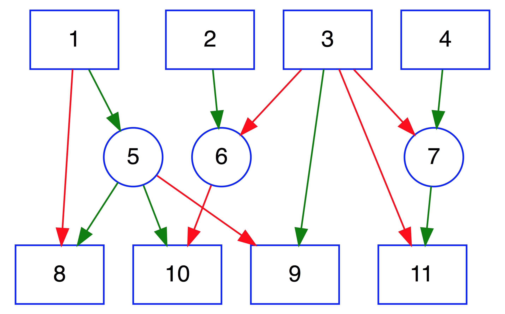

[](https://travis-ci.org/rich-iannone/DiagrammeR)

[](http://issuestats.com/github/rich-iannone/DiagrammeR)
[](http://issuestats.com/github/rich-iannone/DiagrammeR)
[](https://codecov.io/github/rich-iannone/DiagrammeR?branch=master) 

With the **DiagrammeR** package, you can create network graph diagrams. You can either use **Markdown**-like text to describe and render a diagram, or, use a collection of functions to create graph objects. The output can be viewed in the **RStudio** Viewer, it can be incorporated in **R Markdown**, and it can be integrated in **shiny** web apps. Because we are doing this in **R** we can and always should add much more **R** code into the mix.

Go to the [**project website**](http://rich-iannone.github.io/DiagrammeR/) and view a video walkthrough for a graph diagram that's created with a few lines of text and is just as easily customizable. After being all fired up from that intense video-tutorial extravaganza, have a look at the [**DiagrammeR Docs**](http://rich-iannone.github.io/DiagrammeR/docs.html) to learn more.



It's possible to make the above graph diagram using using **Graphviz** **DOT** code (as text within the **DiagrammeR** `grViz()` function) or through a combination of **DiagrammeR** functions, strung together with the **magrittr** `%>%` pipe. 

So, with **Graphviz**:

```r
library(DiagrammeR)

grViz("
digraph DAG {
      
  # Intialization of graph attributes
  graph [overlap = true]
      
  # Initialization of node attributes
  node [shape = box,
        fontname = Helvetica,
        color = blue,
        type = box,
        fixedsize = true]
      
  # Initialization of edge attributes
  edge [color = green,
        rel = yields]
      
  # Node statements
  1; 2; 3; 4; 8; 9; 10; 11
      
  # Revision to node attributes
  node [shape = circle]
      
  # Node statements
  5; 6; 7
      
  # Edge statements
  1->5; 2->6; 3->9; 4->7; 5->8; 5->10; 7->11

  # Revision to edge attributes
  edge [color = red]

  # Edge statements
  1->8; 3->6; 3->11; 3->7; 5->9; 6->10
}
")
```

With **magrittr** and **DiagrammeR**'s graph functions:

```r
library(DiagrammeR)
library(magrittr)

graph <-
  create_graph() %>%
  set_graph_name("DAG") %>%
  set_global_graph_attr("graph", "overlap", "true") %>%
  set_global_graph_attr("graph", "fixedsize", "true") %>%
  set_global_graph_attr("node", "color", "blue") %>%
  set_global_graph_attr("node", "fontname", "Helvetica") %>%
  add_n_nodes(11) %>%
  select_nodes_by_id(1:4) %>% 
  set_node_attr_with_selection("shape", "box") %>%
  set_node_attr_with_selection("type", "box") %>%
  clear_selection %>%
  select_nodes_by_id(5:7) %>% 
  set_node_attr_with_selection("shape", "circle") %>%
  set_node_attr_with_selection("type", "circle") %>%
  clear_selection %>%
  select_nodes_by_id(8:11) %>% 
  set_node_attr_with_selection("shape", "box") %>%
  set_node_attr_with_selection("type", "box") %>%
  clear_selection %>%
  add_edge(1, 5) %>% add_edge(2, 6) %>%
  add_edge(3, 9) %>% add_edge(4, 7) %>%
  add_edge(5, 8) %>% add_edge(5, 10) %>%
  add_edge(7, 11) %>% 
  select_edges %>%
  set_edge_attr_with_selection("color", "green") %>%
  add_edge(1, 8) %>% add_edge(3, 6) %>%
  add_edge(3, 11) %>% add_edge(3, 7) %>%
  add_edge(5, 9) %>% add_edge(6, 10) %>%
  select_edges("color", "^$") %>%
  set_edge_attr_with_selection("color", "red") %>%
  clear_selection

render_graph(graph)
```

The graph functions allow you create graph objects, render those graphs, modify those graphs, get information from the graphs, create a series of graphs, perform scaling of attribute values with data values, and do other useful things.

This functionality makes it possible to generate a network graph with data available in tabular datasets. The general idea is to build specialized data frames that contain either node data and attributes (node data frames) and those data frames that contain edge data and edge attributes (edge data frames). These data frames are permitted to have node and edge attributes and also columns of other data. Because the attributes are always kept alongside the node and edge definitions (within the graph object itself), we can easily work with them and modify the values of the styling attributes and differentiate nodes and edges by size, color, shape, opacity, length, etc. Here is a listing of the available graph functions:


## Graph Example

Let's create a property graph by combining CSV data that pertains to contributors to three software projects. The CSV files (`contributors.csv`, `projects.csv`, and `projects_and_contributors.csv`) are available in the **DiagrammeR** package. Together they provide the properties `name`, `age`, `join_date`,  `email`, `follower_count`, `following_count`, and `starred_count` to the `person` nodes; `project`, `start_date`, `stars`, and `language` to the `project` nodes; and the `contributor_role` and `commits` properties to the edges.

```r
library(DiagrammeR)
library(magrittr)

graph <-
  create_graph() %>%
  set_graph_name("software_projects") %>%
  set_global_graph_attr("graph",
                        "output",
                        "visNetwork") %>%
  add_nodes_from_csv(
    system.file("examples/contributors.csv",
                package = "DiagrammeR"),
    set_type = "person",
    label_col = "name") %>%
  add_nodes_from_csv(
    system.file("examples/projects.csv",
                package = "DiagrammeR"),
    set_type = "project",
    label_col = "project") %>%
  add_edges_from_csv(
    system.file("examples/projects_and_contributors.csv",
                package = "DiagrammeR"),
    from_col = "contributor_name",
    from_attr = "name",
    to_col = "project_name",
    to_attr = "project",
    rel_col = "contributor_role")
```

View the property graph.

```r
graph %>% render_graph
```


Now that the graph is set up, you can construct queries with **magrittr** pipelines to get specific answers from the graph. 

Get the average age of all the contributors:
```r
graph %>% select_nodes("type", "person") %>%
  deposit_node_attr_from_selection("age",
                                   "numeric") %>%
  withdraw_values %>% mean
#> [1] 33.6
```

Get the total number of commits to all software projects:
```r
graph %>% select_edges %>%
  deposit_edge_attr_from_selection("commits",
                                   "numeric") %>%
  withdraw_values %>% sum
#> [1] 5182
```

Get the total number of commits from Josh as a maintainer and as a contributor:
```r
graph %>% select_nodes("name", "Josh") %>%
  trav_out_edge(c("maintainer", "contributer")) %>%
  deposit_edge_attr_from_selection("commits",
                                   "numeric") %>%
  withdraw_values %>% sum
#> [1] 227
```

Get the total number of commits from Louisa:
```r
graph %>% select_nodes("name", "Louisa") %>%
  trav_out_edge %>%
  deposit_edge_attr_from_selection("commits",
                                   "numeric") %>%
  withdraw_values %>% sum
#> [1] 615
```

Get the names of people in graph above age 32:
```r
graph %>% select_nodes("type", "person") %>%
  select_nodes("age", ">32", "intersect") %>%
  deposit_node_attr_from_selection("name") %>%
  withdraw_values
#> [1] "Jack"   "Sheryl" "Roger"  "Kim"    "Jon"
```

Get the total number of commits from all people to the **supercalc** project:
```r
graph %>% select_nodes("project", "supercalc") %>%
  trav_in_edge %>%
  deposit_edge_attr_from_selection("commits", "numeric") %>%
  withdraw_values %>% sum
#> [1] 1676
```

Who committed the most to the **supercalc** project?
```r
graph %>% select_nodes("project", "supercalc") %>%
  trav_in_edge %>%
  deposit_edge_attr_from_selection("commits", "numeric") %>%
  trav_in_node %>%
  trav_in_edge("commits", max(withdraw_values(.))) %>%
  trav_out_node %>%
  deposit_node_attr_from_selection("name") %>%
  withdraw_values
#> [1] "Sheryl"
```

What is the email address of the individual that contributed the least to the **randomizer** project?
```r
graph %>% select_nodes("project", "randomizer") %>%
  trav_in_edge %>%
  deposit_edge_attr_from_selection("commits", "numeric") %>%
  trav_in_node %>%
  trav_in_edge("commits", min(withdraw_values(.))) %>%
  trav_out_node %>%
  deposit_node_attr_from_selection("email") %>%
  withdraw_values
#> [1] "the_will@graphymail.com"
```

Kim is now a contributor to the **stringbuildeR** project and has made 15 new commits to that project. Modify the graph to reflect this and view the updated graph:
```r
graph %<>%
  add_edge(get_nodes(.,
                     "name", "Kim"),
           get_nodes(.,
                     "project", "stringbuildeR"),
           "contributor") %>%
  select_last_edge %>%
  set_edge_attr_with_selection("commits", 15) %>%
  clear_selection

graph %>% render_graph
```


Get all email addresses to contributors (but not maintainers) of the **randomizer** and **supercalc88** projects:
```r
graph %>% select_nodes("project", "randomizer") %>%
  select_nodes("project", "supercalc") %>%
  trav_in_edge("rel", "contributor") %>%
  trav_out_node %>%
  deposit_node_attr_from_selection("email", "character") %>%
  withdraw_values
#> [1] "lhe99@mailing-fun.com"  "josh_ch@megamail.kn"
#> [3] "roger_that@whalemail.net"  "the_simone@a-q-w-o.net"
#> [5] "kim_3251323@ohhh.ai"  "the_will@graphymail.com"
#> [7] "j_2000@ultramail.io"
```

Which committer to the **randomizer** project has the highest number of followers?
```r
graph %>% select_nodes("project", "randomizer") %>%
  trav_in %>%
  deposit_node_attr_from_selection("follower_count",
                                   "numeric") %>%
  select_nodes("project", "randomizer") %>%
  trav_in("follower_count",
          max(withdraw_values(.))) %>%
  deposit_node_attr_from_selection("name") %>%
  withdraw_values
#> [1] "Kim"
```

Which people have committed to more than one project?
```r
graph %>%
  select_nodes_by_degree("out", ">1",
                         "type", "person") %>%
  deposit_node_attr_from_selection("name") %>%
  withdraw_values
#> [1] "Louisa"  "Josh"  "Kim"
```

## Installation

**DiagrammeR** is used in an **R** environment. If you don't have an **R** installation, it can be obtained from the [**Comprehensive R Archive Network (CRAN)**](http://cran.rstudio.com). It is recommended that [**RStudio**](http://www.rstudio.com/products/RStudio/) be used as the **R** IDE to take advantage of its rendering capabilities and the code-coloring support for **Graphviz** and **mermaid** diagrams.

You can install the development version of **DiagrammeR** from **GitHub** using the **devtools** package.

```r
devtools::install_github('rich-iannone/DiagrammeR')
```

Or, get the v0.8.1 release from **CRAN**.

```r
install.packages('DiagrammeR')
```
