[](https://travis-ci.org/rich-iannone/DiagrammeR)

[](https://codecov.io/github/rich-iannone/DiagrammeR?branch=master) 

With the **DiagrammeR** package you can create, modify, analyze, and visualize network graph diagrams. A collection of functions are available for working specifically with graph objects. The output can be incorporated in **RMarkdown** documents, integrated into **Shiny** web apps, converted into other graph formats, or exported as image, PDF, or SVG files.

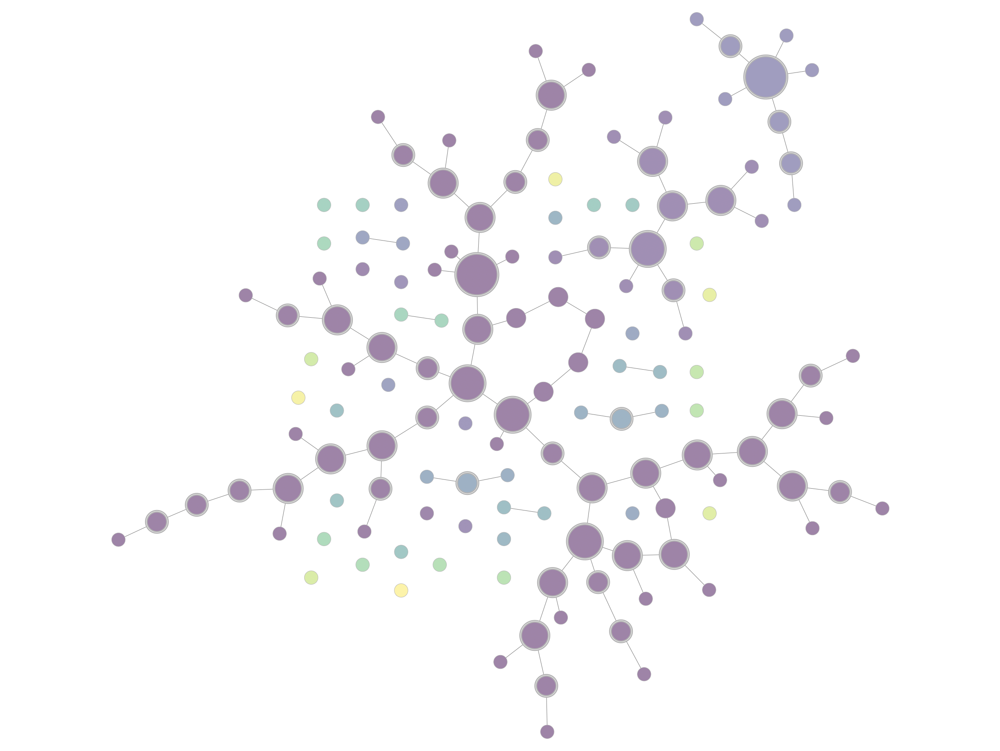

It's possible to make the above graph diagram using a combination of **DiagrammeR** functions strung together with the **magrittr** `%>%` pipe:

```r
library(DiagrammeR)

create_random_graph(
  n = 140, m = 100,
  directed = FALSE,
  set_seed = 23) %>%
  join_node_attrs(get_s_connected_cmpts(.)) %>%
  join_node_attrs(get_degree_total(.)) %>%
  colorize_node_attrs(
    node_attr_from = "sc_component",
    node_attr_to = "fillcolor",
    alpha = 80) %>%
  rescale_node_attrs("total_degree", 0.2, 1.5, "height") %>%
  select_nodes_by_id(get_articulation_points(.)) %>%
  set_node_attrs_ws("peripheries", 2) %>%
  set_node_attrs_ws("penwidth", 3) %>%
  clear_selection() %>%
  set_node_attr_to_display() %>%
  render_graph()
```

**DiagrammeR**'s graph functions allow you to create graph objects, modify those graphs, get information from the graphs, create a series of graphs, perform scaling of attribute values with data values, and many other useful things.

This functionality makes it possible to generate a network graph with data available in tabular datasets. Two specialized data frames contain node data and attributes (node data frames) and edges with associated edge attributes (edge data frames). Because the attributes are always kept alongside the node and edge definitions (within the graph object itself), we can easily work with them and specify styling attributes to differentiate nodes and edges by size, color, shape, opacity, length, and more. Here are some of the available graph functions:

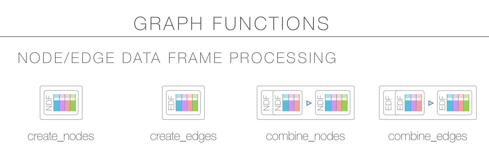
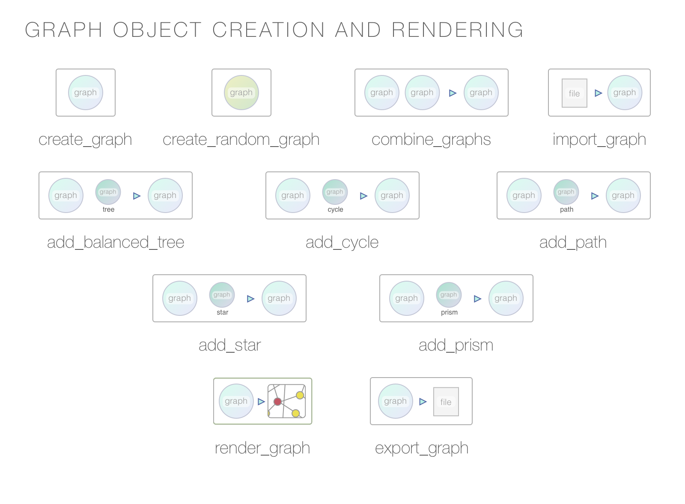
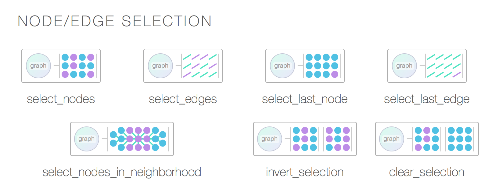
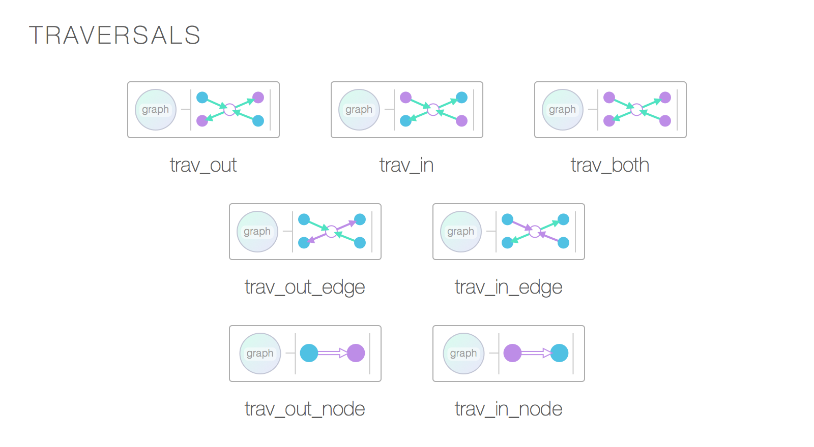
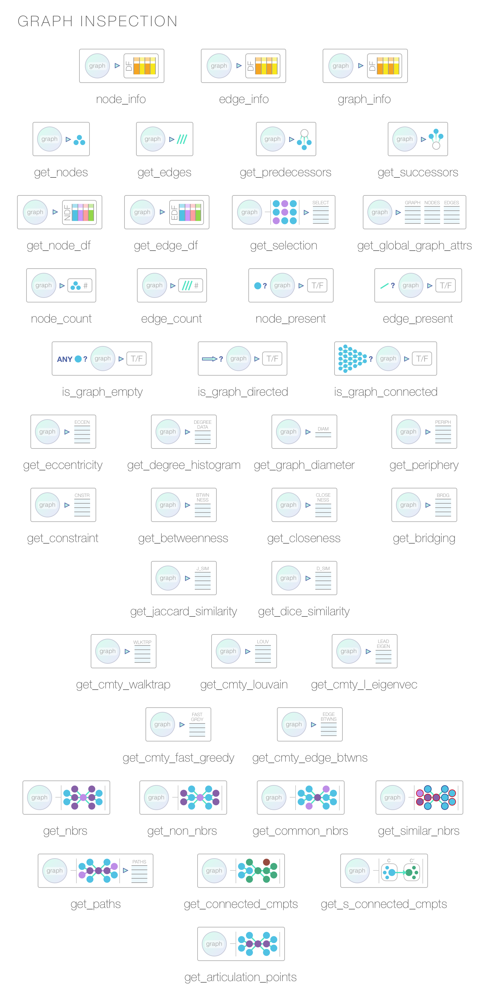
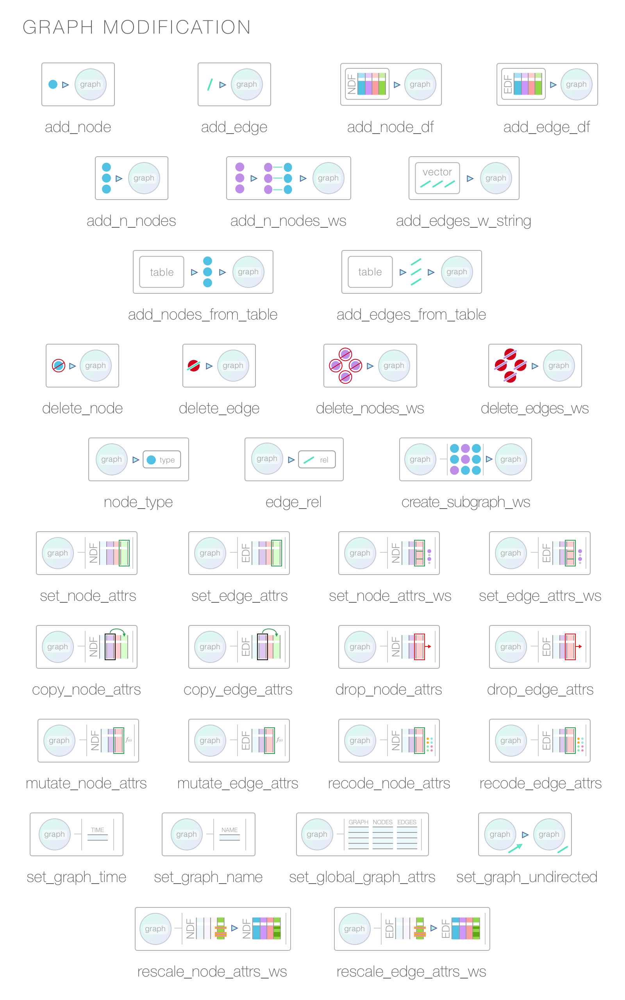
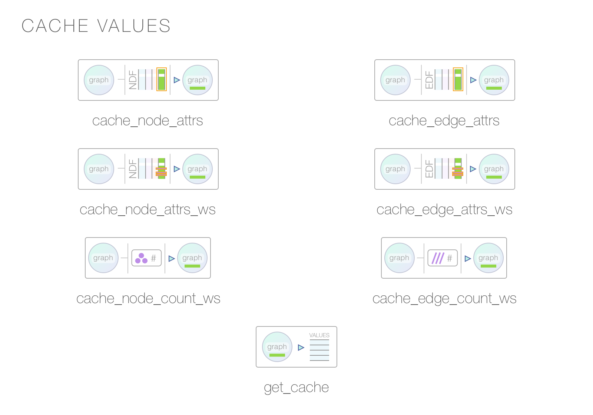
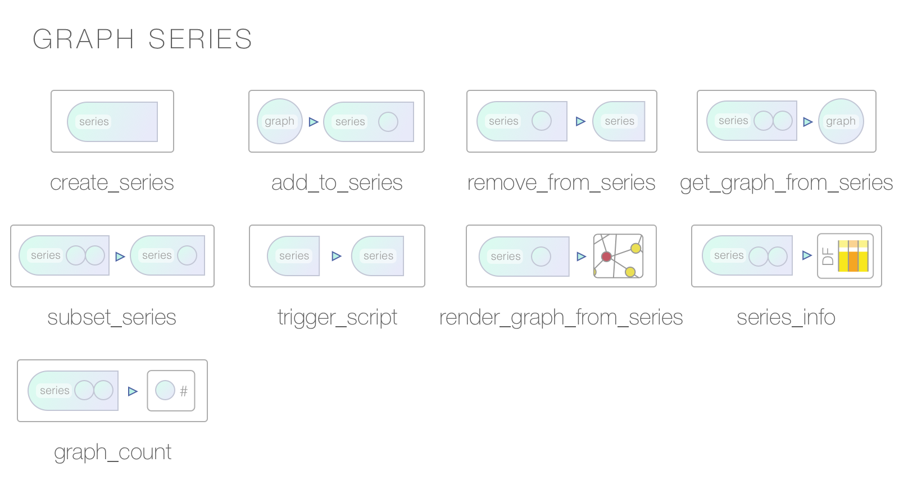


## Network Graph Example

Let's create a property graph that pertains to contributors to three software projects. This graph has nodes representing people and projects. The attributes `name`, `age`, `join_date`,  `email`, `follower_count`, `following_count`, and `starred_count` are specific to the `person` nodes while the `project`, `start_date`, `stars`, and `language` attributes apply to the `project` nodes. The edges represent the relationships between the people and the project.

The example graph file `repository.dgr` is available in the `extdata/example_graphs_dgr/` directory in the **DiagrammeR** package (currently, only for the Github version). We can load it into memory by using the `open_graph()` function, using `system.file()` to provide the location of the file within the package.

```r
library(DiagrammeR)

# Load in a the small repository graph
graph <-
  open_graph(
    system.file(
      "extdata/example_graphs_dgr/repository.dgr",
      package = "DiagrammeR"))
```

We can always view the property graph with the `render_graph()` function.

```r
render_graph(graph, layout = "kk")
```

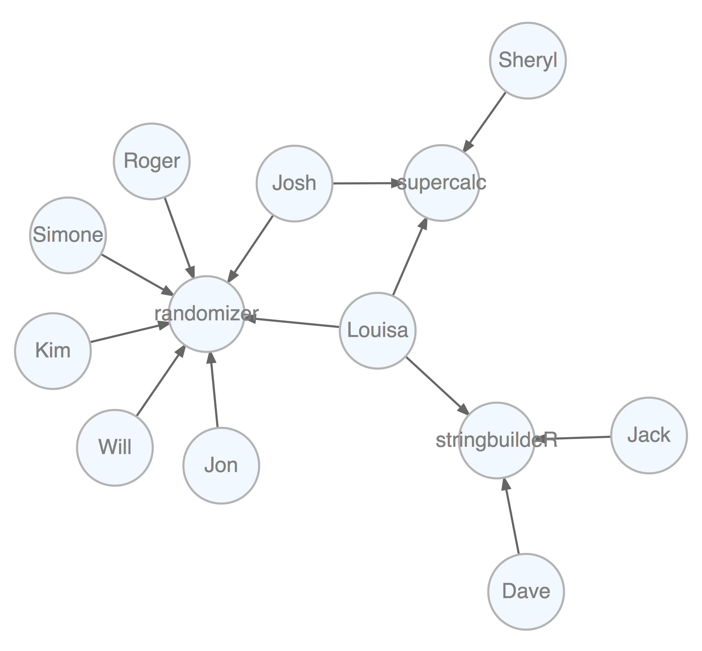

Now that the graph is set up, you can create queries with **magrittr** pipelines to get specific answers from the graph.

Get the average age of all the contributors. Select all nodes of type `person` (not `project`). Each node of that type has non-`NA` `age` attribute, so, get that attribute as a vector with `get_node_attrs_ws()` and then calculate the mean with **R**'s `mean()` function.

```r
graph %>% 
  select_nodes(conditions = "type == 'person'") %>%
  get_node_attrs_ws(node_attr = "age") %>%
  mean()
#> [1] 33.6
```

We can get the total number of commits to all projects. We know that all edges contain the numerical `commits` attribute, so, select all edges (`select_edges()` by itself selects all edges in the graph). After that, get a numeric vector of `commits` values and then get its `sum()` (all commits to all projects).

```r
graph %>% 
  select_edges() %>%
  get_edge_attrs_ws(edge_attr = "commits") %>%
  sum()
#> [1] 5182
```

Single out the one known as Josh and get his total number of commits as a maintainer and as a contributor. Start by selecting the Josh node with `select_nodes(conditions = "name == 'Josh'")`. In this graph, we know that all people have an edge to a project and that edge can be of the relationship (`rel`) type of `contributor` or `maintainer`. We can migrate our selection from nodes to outbound edges with `trav_out_edges()` (and we won't provide a condition, just all the outgoing edges from Josh will be selected). Now we have a selection of 2 edges. Get that vector of `commits` values with `get_edge_attrs_ws()` and then calculate the `sum()`. This is the total number of commits.

```r
graph %>% 
  select_nodes(conditions = "name == 'Josh'") %>%
  trav_out_edge() %>%
  get_edge_attrs_ws(edge_attr = "commits") %>%
  sum()
#> [1] 227
```

Get the total number of commits from Louisa, just from the maintainer role though. In this case we'll supply a condition in `trav_out_edge()`. This acts as a filter for the traversal and this means that the selection will be applied to only those edges where the condition is met. Although there is only a single value, we'll still use `sum()` after `get_edge_attrs_ws()` (a good practice because we may not know the vector length, especially in big graphs).

```r
graph %>% 
  select_nodes(conditions = "name == 'Louisa'") %>%
  trav_out_edge(conditions = "rel == 'maintainer'") %>%
  get_edge_attrs_ws("commits") %>%
  sum()
#> [1] 236
```

How do we do something more complex, like, get the names of people in graph above age 32? First, select all `person` nodes with `select_nodes(conditions = "type == 'person'")`. Then, follow up with another `select_nodes()` call specifying `age > 32`. Importantly, have `set_op = "intersect"` (giving us the intersection of both selections).

Now that we have the starting selection of nodes we want, we need to get all values of these nodes' `name` attribute as a character vector. We do this with the `get_node_attrs_ws()` function. After getting that vector, sort the names alphabetically with the **R** function `sort()`. Because we get a named vector, we can use `unname()` to not show us the names of each vector component.

```r
graph %>% 
  select_nodes(conditions = "type == 'person'") %>%
  select_nodes(
    conditions = "age > 32",
    set_op = "intersect") %>%
  get_node_attrs_ws(node_attr = "name") %>%
  sort() %>%
  unname()
#> [1] "Jack"   "Jon"    "Kim"    "Roger"  "Sheryl"
```

Another way to express the same selection of nodes is to use the `mk_cond()` (i.e., 'make condition') helper function to compose the selection conditions. It uses sets of 3 elements for each condition:

    (1) the node or edge attribute name (character value)
    (2) the conditional operator (character value)
    (3) the value for the node or edge attribute
  
A linking `&` or `|` between groups of these three elements is used to specify `AND`s or `OR`s. The `mk_cond()` helper is also useful for supplying variables to a condition for a number of `select_...()` and all `trav_...()` functions.

```r
graph %>% 
  select_nodes(
    conditions =
      mk_cond(
        "type", "==", "person",
        "&",
        "age",  ">",  32)) %>%
  get_node_attrs_ws(node_attr = "name") %>%
  sort() %>%
  unname()
#> [1] "Jack"   "Jon"    "Kim"    "Roger"  "Sheryl"
```

That **supercalc** project is progressing quite nicely. Let's get the total number of commits from all people to that most interesting project. Start by selecting that project's node and work backwards. Traverse to the edges leading to it with `trav_in_edge()`. Those edges are from committers and they all contain the `commits` attribute with numerical values. Get a vector of `commits` and then get the sum (there are `1676` commits).
```r
graph %>% 
  select_nodes(conditions = "project == 'supercalc'") %>%
  trav_in_edge() %>%
  get_edge_attrs_ws("commits") %>%
  sum()
#> [1] 1676
```

How would we find out who committed the most to the **supercalc** project? This is an extension of the previous problem and there are actually a few ways to do this. We start the same way (at the project node, using `select_nodes()`), then:

- traverse to the inward edges (with `trav_in_edge()`)
- cache the `commits` values found in these selected edges (with `cache_edge_attrs_ws()`)
- use `select_edges()` and compose the edge selection condition with the `mk_cond()` helper, where the edge has a `commits` value equal to the largest value in the cache; then, use the `intersect` set operation to restrict the selection to those edges already selected by the `trav_in_edge()` traversal function
- we want the person responsible for these commits; traverse to that node from the edge selection with `trav_out_node()`
- get the `name` value found in this single, selected node with the `get_node_attrs_ws()` function

```r
graph %>% 
  select_nodes(conditions = "project == 'supercalc'") %>%
  trav_in_edge() %>%
  cache_edge_attrs_ws(
    edge_attr = "commits",
    name = "supercalc_commits") %>%
  select_edges(
    conditions = 
      mk_cond(
        "commits", "==", get_cache(.) %>% max()),
    set_op = "intersect") %>%
  trav_out_node() %>%
  get_node_attrs_ws(node_attr = "name") %>%
  unname()
#> [1] "Sheryl"
```

What is the email address of the individual that contributed the least to the **randomizer** project?

```r
graph %>% 
  select_nodes(conditions = "project == 'randomizer'") %>%
  trav_in_edge() %>%
  cache_edge_attrs_ws(
    edge_attr = "commits",
    name = "n_commits") %>%
  trav_in_node() %>%
  trav_in_edge(
    conditions = 
      mk_cond(
        "commits", "==",
        get_cache(., name = "n_commits") %>% min())) %>%
  trav_out_node() %>%
  get_node_attrs_ws(node_attr = "email") %>%
  unname()
#> [1] "the_will@graphymail.com"
```

Kim is now a contributor to the **stringbuildeR** project and has made 15 new commits to that project. We can modify the graph to reflect this.

First, add an edge with `add_edge()`. Note that `add_edge()` usually relies on node IDs in `from` and `to` when creating the new edge. This is almost always inconvenient so we can instead use node labels (we know they are unique in this graph) to compose the edge, setting `use_labels = TRUE`.

The `rel` value in `add_edge()` was set to `contributor` -- in a property graph we always have values set for all node `type` and edge `rel` attributes. We will set another attribute for this edge (`commits`) by first selecting the edge (it was the last edge made: use `select_last_edges_created()`), then, use `set_edge_attrs_ws()` and provide the attribute/value pair. Finally, clear the active selections with `clear_selection()`. The graph is now changed, have a look.

```r
graph <- 
  graph %>%
  add_edge(
    from = "Kim",
    to = "stringbuildeR",
    rel = "contributor",
    use_labels = TRUE) %>%
  select_last_edges_created() %>%
  set_edge_attrs_ws(
    edge_attr = "commits",
    value = 15) %>%
  clear_selection()

render_graph(graph, layout = "kk")
```

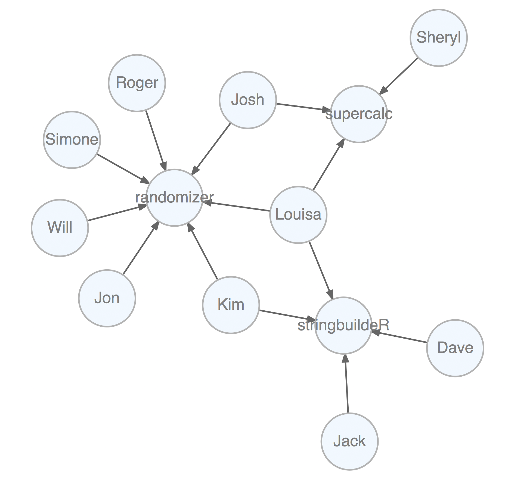

Get all email addresses for contributors (but not maintainers) of the **randomizer** and **supercalc88** projects. Multiple `select_nodes()` calls in succession is an `OR` selection of nodes (`project` nodes selected can be `randomizer` or `supercalc`). With `trav_in_edge()` we just want the `contributer` edges/commits. Once on those edges, hop back unconditionally to the people from which the edges originate with `trav_out_node()`. Get the `email` values from those selected individuals as a sorted character vector. 

```r
graph %>% 
  select_nodes(
    conditions = "project == 'randomizer'") %>%
  select_nodes(
    conditions = "project == 'supercalc'") %>%
  trav_in_edge(conditions = "rel == 'contributor'") %>%
  trav_out_node() %>%
  get_node_attrs_ws(node_attr = "email") %>%
  sort() %>%
  unname()
#> [1] "j_2000@ultramail.io"      "josh_ch@megamail.kn"     
#> [3] "kim_3251323@ohhh.ai"      "lhe99@mailing-fun.com"   
#> [5] "roger_that@whalemail.net" "the_simone@a-q-w-o.net"  
#> [7] "the_will@graphymail.com" 
```

Which people have committed to more than one project? This is a matter of node degree. We know that people have edges outward and projects and edges inward. Thus, anybody having an outdegree (number of edges outward) greater than `1` has committed to more than one project. Globally, select nodes with that condition using `select_nodes_by_degree("outdeg > 1")`. Once getting the `name` attribute values from that node selection, we can provide a sorted character vector of names.

```r
graph %>%
  select_nodes_by_degree(
    expressions = "outdeg > 1") %>%
  get_node_attrs_ws(node_attr = "name") %>%
  sort() %>%
  unname()
#> [1] "Josh"   "Kim"    "Louisa"
```

## Installation

**DiagrammeR** is used in an **R** environment. If you don't have an **R** installation, it can be obtained from the [**Comprehensive R Archive Network (CRAN)**](https://cran.r-project.org/).

You can install the development (v0.9.1) version of **DiagrammeR** from **GitHub** using the **devtools** package.

```r
devtools::install_github("rich-iannone/DiagrammeR")
```

Or, get it from **CRAN**.

```r
install.packages("DiagrammeR")
```
