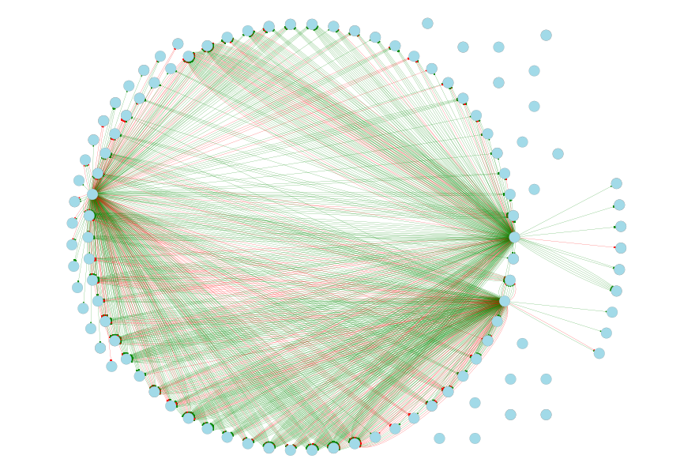

[](https://travis-ci.org/rich-iannone/DiagrammeR)

[](http://issuestats.com/github/rich-iannone/DiagrammeR)
[](http://issuestats.com/github/rich-iannone/DiagrammeR)
[](https://codecov.io/github/rich-iannone/DiagrammeR?branch=master) 

With **DiagrammeR**, you can easily create graph diagrams. You can either use **Markdown**-like text to describe and render a diagram, or, use a collection of functions to create graph objects. The output can be viewed in the **RStudio** Viewer, it can be incorporated in **R Markdown**, and it can be integrated in **shiny** web apps. Because we are doing this in **R** we can and always should add much more **R** code into the mix.

Go to the [**project website**](http://rich-iannone.github.io/DiagrammeR/) and view a video walkthrough for a graph diagram that's created with a few lines of text and is just as easily customizable. After being all fired up from that intense video-tutorial extravaganza, have a look at the [**DiagrammeR Docs**](http://rich-iannone.github.io/DiagrammeR/docs.html) to learn more.


It's possible to make the above graph diagram using using **Graphviz** **DOT** code (as text within the **DiagrammeR** `grViz()` function) or through a combination of **DiagrammeR** functions, strung together with the **magrittr** `%>%` pipe. 

So, with **Graphviz**:

```r
library(DiagrammeR)

grViz("
digraph DAG {
      
  # Intialization of graph attributes
  graph [overlap = true]
      
  # Initialization of node attributes
  node [shape = box,
        fontname = Helvetica,
        color = blue,
        type = box,
        fixedsize = true]
      
  # Initialization of edge attributes
  edge [color = green,
        rel = yields]
      
  # Node statements
  1; 2; 3; 4; 8; 9; 10; 11
      
  # Revision to node attributes
  node [shape = circle]
      
  # Node statements
  5; 6; 7
      
  # Edge statements
  1->5; 2->6; 3->9; 4->7; 5->8; 5->10; 7->11

  # Revision to edge attributes
  edge [color = red]

  # Edge statements
  1->8; 3->6; 3->11; 3->7; 5->9; 6->10
}
")
```

With **magrittr** and **DiagrammeR**'s graph functions:

```r
library(DiagrammeR)
library(magrittr)

graph <-
  create_graph() %>%
  set_graph_name("DAG") %>%
  set_global_graph_attr("graph", "overlap", "true") %>%
  set_global_graph_attr("graph", "fixedsize", "true") %>%
  set_global_graph_attr("node", "color", "blue") %>%
  set_global_graph_attr("node", "fontname", "Helvetica") %>%
  add_n_nodes(11) %>%
  select_nodes_by_id(1:4) %>% 
  set_node_attr_with_selection("shape", "box") %>%
  set_node_attr_with_selection("type", "box") %>%
  clear_selection %>%
  select_nodes_by_id(5:7) %>% 
  set_node_attr_with_selection("shape", "circle") %>%
  set_node_attr_with_selection("type", "circle") %>%
  clear_selection %>%
  select_nodes_by_id(8:11) %>% 
  set_node_attr_with_selection("shape", "box") %>%
  set_node_attr_with_selection("type", "box") %>%
  clear_selection %>%
  add_edge(1, 5) %>% add_edge(2, 6) %>%
  add_edge(3, 9) %>% add_edge(4, 7) %>%
  add_edge(5, 8) %>% add_edge(5, 10) %>%
  add_edge(7, 11) %>% select_edges %>%
  set_edge_attr_with_selection("color", "green") %>%
  add_edge(1, 8) %>% add_edge(3, 6) %>%
  add_edge(3, 11) %>% add_edge(3, 7) %>%
  add_edge(5, 9) %>% add_edge(6, 10) %>%
  select_edges("color", "^$") %>%
  set_edge_attr_with_selection("color", "red") %>%
  clear_selection

render_graph(graph)
```

The graph functions allow you create graph objects, render those graphs, modify those graphs, get information from the graphs, create a series of graphs, perform scaling of attribute values with data values, and do other useful things.

This functionality makes it possible to generate a network graph with data available in tabular datasets. The general idea is to build specialized data frames that contain either node data and attributes (node data frames) and those data frames that contain edge data and edge attributes (edge data frames). These data frames are permitted to have node and edge attributes and also columns of other data. Because the attributes are always kept alongside the node and edge definitions (within the graph object itself), we can easily work with them and modify the values of the styling attributes and differentiate nodes and edges by size, color, shape, opacity, length, etc. Here is a listing of the available graph functions:


## An Example with Data from the **nycflights13** Package

Using the `flights` dataset from the **nycflights13** **R** package, we can create a graph diagram. Here, the green lines show flights that weren't late arriving at their destinations (red indicates those late arrivals).



The **R** code for generating this:

```r
library("DiagrammeR") 
library("nycflights13")
library("lubridate")
library("magrittr")
 
# Choose a day from 2013 for NYC flight data
# (You can choose any Julian day, it's interesting to see results for different days)
day_of_year <- 10 

# Get a data frame of complete cases (e.g., flights have departure and arrival times)
nycflights13 <-
  nycflights13::flights[which(complete.cases(nycflights13::flights) == TRUE), ]

# Generate a POSIXct vector of dates using the 'ISOdatetime' function
# Columns 1, 2, and 3 are year, month, and day columns
# Column 4 is a 4-digit combination of hours (00-23) and minutes (00-59)
date_time <-
  data.frame("date_time" =
               ISOdatetime(year = nycflights13[,1],
                           month = nycflights13[,2],
                           day = nycflights13[,3],
                           hour = gsub("[0-9][0-9]$", "", nycflights13[,4]),
                           min = gsub(".*([0-9][0-9])$", "\\1", nycflights13[,4]),
                           sec = 0, tz = "GMT"))

# Add the POSIXct vector 'date_time' to the 'nycflights13' data frame
nycflights13 <- cbind(date_time, nycflights13)

# Select flights only from the specified day of the year 2013
nycflights13_day <-
  subset(nycflights13,
         date_time >= ymd('2013-01-01', tz = "GMT") + days(day_of_year - 1) &
           date_time < ymd('2013-01-01', tz = "GMT") + days(day_of_year))

# Create the node data frame
# Column 12 is the 3-letter code for the airport departing from
# Column 13 is for the airport arriving to
# (Option: change df to 'nycflights13_day' and only airports used for the day will be included)
nodes_df <- create_nodes(nodes = unique(c(nycflights13[,12],
                                    nycflights13[,13])),
                         label = FALSE)

# The edge data frame must have columns named 'from' and 'to'
# The color attribute is determined with an 'ifelse' statement, where
# column 8 is the minutes early (negative values) or minutes late (positive values)
# for the flight arrival
edges_df <- create_edges(from = nycflights13_day[,12],
                         to = nycflights13_day[,13],
                         color = ifelse(nycflights13_day[,8] < 0,
                                    "green", "red"))

# Set the graph diagram's default attributes for...

# ...nodes
node_attrs <- c("style = filled", "fillcolor = lightblue",
                "color = gray", "shape = circle", "fontname = Helvetica",
                "width = 1")

# ...edges
edge_attrs <- c("arrowhead = dot")

# ...and the graph itself
graph_attrs <- c("layout = circo",
                 "overlap = false",
                 "fixedsize = true",
                 "ranksep = 3",
                 "outputorder = edgesfirst")

# Generate the graph diagram in the RStudio Viewer.
create_graph(nodes_df = nodes_df, edges_df = edges_df,
               graph_attrs = graph_attrs, node_attrs = node_attrs,
               edge_attrs = edge_attrs, directed = TRUE) %>%
  render_graph(width = 1200, height = 800)
```

## Installation

**DiagrammeR** is used in an **R** environment. If you don't have an **R** installation, it can be obtained from the [**Comprehensive R Archive Network (CRAN)**](http://cran.rstudio.com). It is recommended that [**RStudio**](http://www.rstudio.com/products/RStudio/) be used as the **R** IDE to take advantage of its rendering capabilities and the code-coloring support for **Graphviz** and **mermaid** diagrams.

You can install the development version of **DiagrammeR** from **GitHub** using the **devtools** package.

```r
devtools::install_github('rich-iannone/DiagrammeR')
```

Or, get the v0.8.1 release from **CRAN**.

```r
install.packages('DiagrammeR')
```
