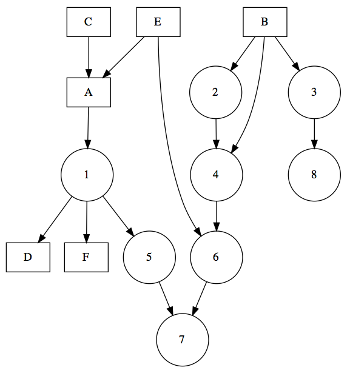
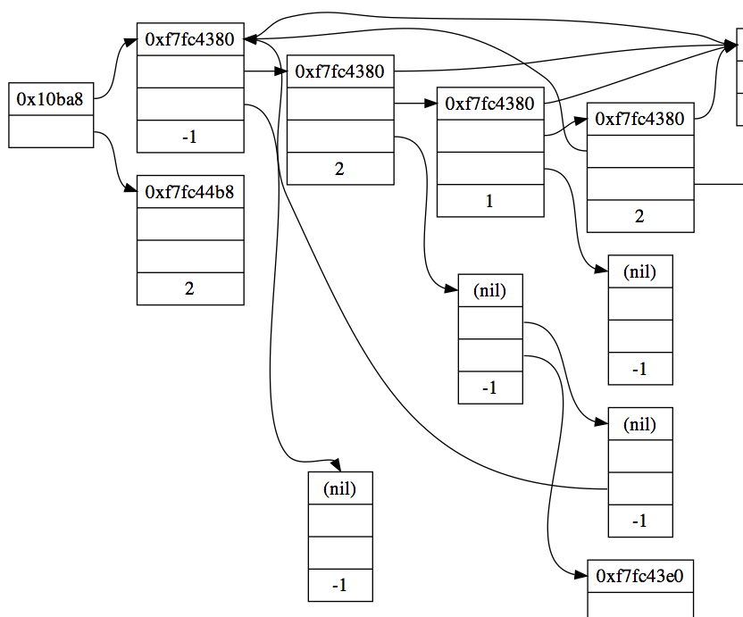

With the DiagrammeR package, you can create diagrams and flowcharts using R. Markdown-like text is used to describe a diagram and, by doing this in R, we can also add some R code into the mix and integrate these diagrams in the **R** console, through **R Markdown**, and in **shiny** apps.

### Installation

Install the development version of **DiagrammeR** from GitHub using the `devtools` package.

```R
devtools::install_github('rich-iannone/DiagrammeR')
```

Or, get the latest [CRAN release](http://cran.r-project.org/web/packages/DiagrammeR/).

```R
install.packages("DiagrammeR")
```

### Introduction

The package leverages the infrastructure provided by [**htmlwidgets**](http://htmlwidgets.org) to bridge **R** and  both [**mermaid.js**](https://github.com/knsv/mermaid) and [**viz.js**](https://github.com/mdaines/viz.js/).


### Mermaid Graphs

The `mermaid` function processes the specification of a diagram and then renders the diagram. This diagram spec can either exist in the form of a string, a reference to a mermaid file (with a **.mmd** file extension), or as a connection. 

The **mermaid**-style graph specification begins with a declaration of `graph` followed by the graph direction. The directions can be:

- `LR` left to right
- `RL` right to left
- `TB` top to bottom
- `BT` bottom to top
- `TD` top down (same as `TB`)

Nodes can be given arbitrary ID values and those IDs are displayed as text within their respective boxes. Connections between nodes are denoted by:

- `-->` arrow connection
- `---` line connection

Simply joining up a series of nodes in a left-to-right graph can be done in a few lines:

```R
diagram <- "
graph LR
  A-->B
  A-->C
  C-->E
  B-->D
  C-->D
  D-->F
  E-->F
"

mermaid(diagram)
```

This renders the following image:


The same result can be achieved in a more succinct manner with this R statement (using semicolons between statements in the **mermaid** diagram spec):

```R
mermaid("graph LR; A-->B; A-->C; C-->E; B-->D; C-->D; D-->F; E-->F")
```

Alternatively, here is the result of using the statement `graph TB` in place of `graph LR`:


Keep in mind that external files can also be called by the `DiagrammeR` function. The file `graph.mmd` can contain the text of the diagram spec as follows

```
graph LR
  A-->B
  A-->C
  C-->E
  B-->D
  C-->D
  D-->F
  E-->F
```

and be rendered through:

```R
mermaid("graph.mmd")
```

Alright, here's another example. This one places some text inside the diagram objects. Also, there are some CSS styles to add a color fill to each of the diagram objects:

```R
diagram <- "
graph LR
A(Rounded)-->B[Squared]
B-->C{A Decision}
C-->D[Square One]
C-->E[Square Two]
    
style A fill:#DCEBE3
style B fill:#77DFC9
style C fill:#DEDBBA
style D fill:#F8F0CC
style E fill:#FCFCF2
"
    
mermaid(diagram)
```

What you get is this:


Here's an example with line text (that is, text appearing on connecting lines). Simply place text between pipe characters, just after the arrow, right before the node identifier. There are few more CSS properties for the boxes included in this example (`stroke`, `stroke-width`, and `stroke-dasharray`).

```R
diagram <- "
graph LR
A(Start)-->|Line Text|B(Keep Going)
B-->|More Line Text|C(Stop)
    
style A fill:#A2EB86, stroke:#04C4AB, stroke-width:2px
style B fill:#FFF289, stroke:#FCFCFF, stroke-width:2px, stroke-dasharray: 4, 4
style C fill:#FFA070, stroke:#FF5E5E, stroke-width:2px
"

mermaid(diagram)
```

The resultant graphic:


Let's include the values of some R objects into a fresh diagram. The `mtcars` dataset is something I go to again and again so I'm going to load it up.

```R
data(mtcars)
```

When you call the R `summary` function on this data frame, you obtain this:

```
     mpg             cyl             disp             hp             drat      
 Min.   :10.40   Min.   :4.000   Min.   : 71.1   Min.   : 52.0   Min.   :2.760  
 1st Qu.:15.43   1st Qu.:4.000   1st Qu.:120.8   1st Qu.: 96.5   1st Qu.:3.080  
 Median :19.20   Median :6.000   Median :196.3   Median :123.0   Median :3.695  
 Mean   :20.09   Mean   :6.188   Mean   :230.7   Mean   :146.7   Mean   :3.597  
 3rd Qu.:22.80   3rd Qu.:8.000   3rd Qu.:326.0   3rd Qu.:180.0   3rd Qu.:3.920  
 Max.   :33.90   Max.   :8.000   Max.   :472.0   Max.   :335.0   Max.   :4.930  
       wt             qsec             vs               am              gear      
 Min.   :1.513   Min.   :14.50   Min.   :0.0000   Min.   :0.0000   Min.   :3.000  
 1st Qu.:2.581   1st Qu.:16.89   1st Qu.:0.0000   1st Qu.:0.0000   1st Qu.:3.000  
 Median :3.325   Median :17.71   Median :0.0000   Median :0.0000   Median :4.000  
 Mean   :3.217   Mean   :17.85   Mean   :0.4375   Mean   :0.4062   Mean   :3.688  
 3rd Qu.:3.610   3rd Qu.:18.90   3rd Qu.:1.0000   3rd Qu.:1.0000   3rd Qu.:4.000  
 Max.   :5.424   Max.   :22.90   Max.   :1.0000   Max.   :1.0000   Max.   :5.000  
      carb      
 Min.   :1.000  
 1st Qu.:2.000  
 Median :2.000  
 Mean   :2.812  
 3rd Qu.:4.000  
 Max.   :8.000 
```

That information can placed into a diagram. First, we'll get a vector object for strings that specify each of the connections and the text inside the boxes (one for each `mtcars` dataset column). These strings will contain each of the statistics provided by the `summary` function (minimum, 1st quartile, median, mean, 3rd quartile, and maximum). We'll use a `sapply` to loop through each column.

```R
connections <- sapply(
  1:ncol(mtcars)
  , function(i){
    paste0(
      i
      , "(", colnames(mtcars)[i], ")---"
      , i, "-stats("
      , paste0(
        names(summary(mtcars[,i]))
        , ": "
        , unname(summary(mtcars[,i]))
        , collapse="<br/>"
      )
      , ")"
    )
  }
)
``` 

This generates all of the syntax required for connections between column names to the statistical summary text in each of the adjoining boxes. Notice the use of the `<br/>` tag that terminates each of the stats inside the `paste0` statement. They provide the necessary linebreaks for text within each diagram object.

Now, to generate the code for the summary diagram, one can use a `paste0` statement and then a separate `paste` statement for the connection text (with the `collapse` argument set to `\n` to specify a linebreak for the output text). Note that within the `paste0` statement, there is a `\n` linebreak wherever you would need one. Finally, to style multiple objects, a `classDef` statement was used. Here, a class of type `column` was provided with values for certain CSS properties. On the final line, the `class` statement applied the class definition to nodes 1 through 11 (a comma-separated list generated by the `paste0` statement). 

```R
diagram <-
paste0(
"graph TD;", "\n",
paste(connections, collapse = "\n"), "\n",
"classDef column fill:#0001CC, stroke:#0D3FF3, stroke-width:1px;" ,"\n",
"class ", paste0(1:length(connections), collapse = ","), " column;
")

mermaid(diagram)
```

This is part of the resulting graphic (it's quite wide so I'm displaying just 8 of the 11 columns):


The **mermaid.js** library also supports [sequence diagrams](http://knsv.github.io/mermaid/sequenceDiagram.html). The ["How to Draw Sequence Diagrams"](http://www.cs.uku.fi/research/publications/reports/A-2003-1/page91.pdf) report by Poranen, Makinen, and Nummenmaa offers a good introduction to sequence diagrams. Let's replicate the ticket-buying example from Figure 1 of this report and add in some conditionals.

```R
# Using this "How to Draw a Sequence Diagram" 
# http://www.cs.uku.fi/research/publications/reports/A-2003-1/page91.pdf
# draw some sequence diagrams with DiagrammeR

mermaid("
sequenceDiagram
  customer->>ticket seller: ask ticket
  ticket seller->>database: seats
  alt tickets available
    database->>ticket seller: ok
    ticket seller->>customer: confirm
    customer->>ticket seller: ok
    ticket seller->>database: book a seat
    ticket seller->>printer: print ticket
  else sold out
    database->>ticket seller: none left
    ticket seller->>customer: sorry
  end
")
```


For more examples and additional documentation, see the [`mermaid.js` Wiki](https://github.com/knsv/mermaid/wiki).

### Graphviz Graphs

It's possible to make diagrams using Graphviz support within DiagrammeR. The analogous processing function here is `grViz`. Again, the diagram spec can either exist in the form of a string, a reference to a Graphviz file (with a .gv file extension), or as a connection.

Here is an example where nodes (in this case styled as boxes and rectangles) can be easily defined along with their connections: 

```R
boxes_and_rectangles <- "
digraph boxes_and_rectangles {
node [shape = box]
A
B
C
D
E
F
node [shape = circle, fixedsize = true, width = 0.9]
1
2
3
4
5
6
7
8

A->1
B->2
B->3
B->4
C->A
1->D
E->A
2->4
1->5
1->F
E->6
4->6
5->7
6->7
3->8

overlap = true
fontsize = 10;
}
"

grViz(boxes_and_rectangles)
```



Here's another example! Let's **rvest** and pipe w/ **pipeR** (because it's fun):

```R
library(rvest)
library(XML)
library(pipeR)

# if you're on Windows, try this option:
# options(viewer = NULL)

# Generate all the examples from viz.js GitHub repo
html("https://raw.githubusercontent.com/mdaines/viz.js/gh-pages/example.html") %>>%
  html_nodes("script[type='text/vnd.graphviz']") %>>%
  lapply(
    function(x){
      xmlValue(x) %>>% (~ htmltools::html_print(grViz(.)) ) %>>% DiagrammeR(type="grViz")
    }
  )
```

Here's a sampling from that:



Isn't this great? Let's take in some examples straight from the Graphviz gallery:

```R
readLines("http://www.graphviz.org/Gallery/directed/fsm.gv.txt") %>>%
  grViz

readLines("http://www.graphviz.org/Gallery/directed/Genetic_Programming.gv.txt") %>>%
  grViz

readLines("http://www.graphviz.org/Gallery/directed/unix.gv.txt") %>>%
  grViz
```

You get some nice figures as a result. Try 'em, you'll see.

### DiagrammeR + shiny

As with other **htmlwidgets**, we can easily dynamically bind **DiagrammeR** in **R** with **shiny**. Here is a quick example where we can provide a diagram spec in a `textInput`.

```R
library(shiny)

ui = shinyUI(fluidPage(
  textInput('spec', 'Diagram Spec', value = ""),
  DiagrammeROutput('diagram')
))

server = function(input, output){
  output$diagram <- renderDiagrammeR(DiagrammeR(
    input$spec
  ))
}

shinyApp(ui = ui, server = server)
```
