 [](http://issuestats.com/github/rich-iannone/DiagrammeR) [](http://issuestats.com/github/rich-iannone/DiagrammeR)

With the **DiagrammeR** package, you can create graph diagrams and flowcharts using **R**. You can either use **Markdown**-like text to describe and render a diagram, or, use a collection of functions to create graph objects from **R** objects and render/export at will. Because we are doing this in **R** we can always add some **R** code into the mix. The output can be viewed in the **RStudio** Viewer, it can be incorporated in **R Markdown**, and it can be integrated in **shiny** web apps.


Go to the [**project website**](http://rich-iannone.github.io/DiagrammeR/) and view a video walkthrough for a graph diagram that's created with a few lines of text and is just as easily customizable.

Have a look at the [**DiagrammeR Docs**](http://rich-iannone.github.io/DiagrammeR/docs.html). You can really learn a lot more about **DiagrammeR** there (much more than from this `README`). 

The package leverages the infrastructure provided by [**htmlwidgets**](http://htmlwidgets.org) to bridge **R** and both [**mermaid.js**](https://github.com/knsv/mermaid) and [**viz.js**](https://github.com/mdaines/viz.js/).


### Installation

Install the development version of **DiagrammeR** from GitHub using the **devtools** package.

```r
devtools::install_github('rich-iannone/DiagrammeR')
```

Or, get the v0.6 release from **CRAN**.

```r
install.packages('DiagrammeR')
```

### Graphviz Graphs

It's possible to make diagrams using the **Graphviz** support included in the **DiagrammeR** package. The processing function is called `grViz`. What you pass into `grViz` is a valid graph in the **DOT** language. The text can either exist in the form of a string, a reference to a **Graphviz** file (with a **.gv** file extension), or as a text connection. Furthermore, functions exist for generating graph diagrams without need for the user to directly manipulate **DOT** code.

#### Directly Defining a Graphviz Graph

Here is an example where nodes (in this case styled as boxes and circles) can be easily defined along with their connections:

```r
grViz("
digraph boxes_and_circles {
  
  # a 'graph' statement
  graph [overlap = true]
  
  # several 'node' statements
  node [shape = box,
        fontname = Helvetica]
  A; B; C; D; E; F
  
  node [shape = circle,
        fixedsize = true,
        width = 0.9] // sets as circles
  1; 2; 3; 4; 5; 6; 7; 8

  # several 'edge' statements
  A->1; B->2; B->3; B->4; C->A
  1->D; E->A; 2->4; 1->5; 1->F
  E->6; 4->6; 5->7; 6->7; 3->8
}
")
```

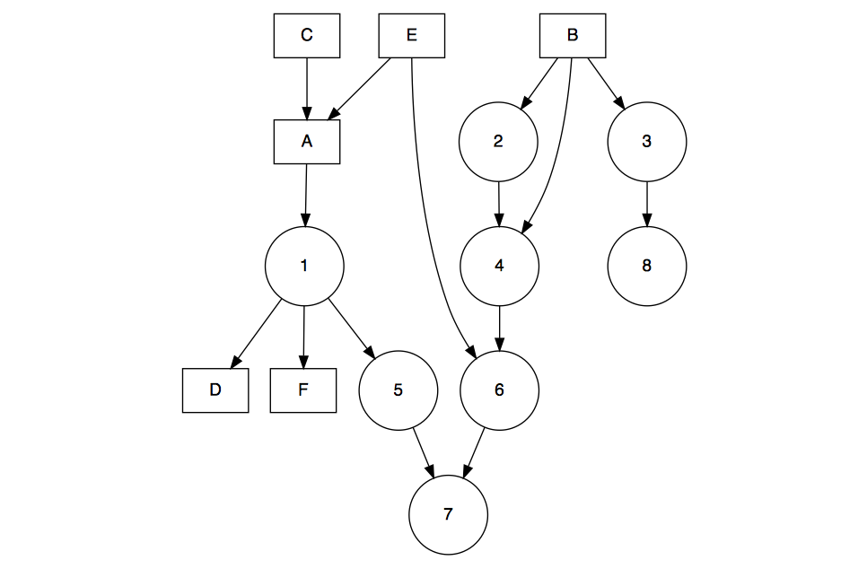

The attributes of the nodes and the edges can be easily modified. In the following, colors can be selectively changed in attribute lists.

```r
grViz("
digraph boxes_and_circles {
  
  # a 'graph' statement
  graph [overlap = true]
  
  # several 'node' statements
  node [shape = box,
        fontname = Helvetica,
        color = blue] // for the letter nodes, use box shapes
  A; B; C; D; E
  F [color = black]
  
  node [shape = circle,
        fixedsize = true,
        width = 0.9] // sets as circles
  1; 2; 3; 4; 5; 6; 7; 8

  # several 'edge' statements
  edge [color = gray] // this sets all edges to be gray (unless overridden)
  A->1; B->2                   // gray
  B->3 [color = red]           // red
  B->4                         // gray
  C->A [color = green]         // green
  1->D; E->A; 2->4; 1->5; 1->F // gray
  E->6; 4->6; 5->7; 6->7       // gray
  3->8 [color = blue]          // blue
}
")
```


#### Colors

By default, **Graphviz** can use colors provided as hexadecimal values, or, as **X11** color names. The following provides the entire list of **X11** color names. Some colors have additional 4-color palettes based on the named color. Those additional colors can be used by appending the digits `1`-`4` to the color name. Gray (or grey) has variations from `0`-`100`. Please note that, in all color names, 'gray' is interchangeable with 'grey'.

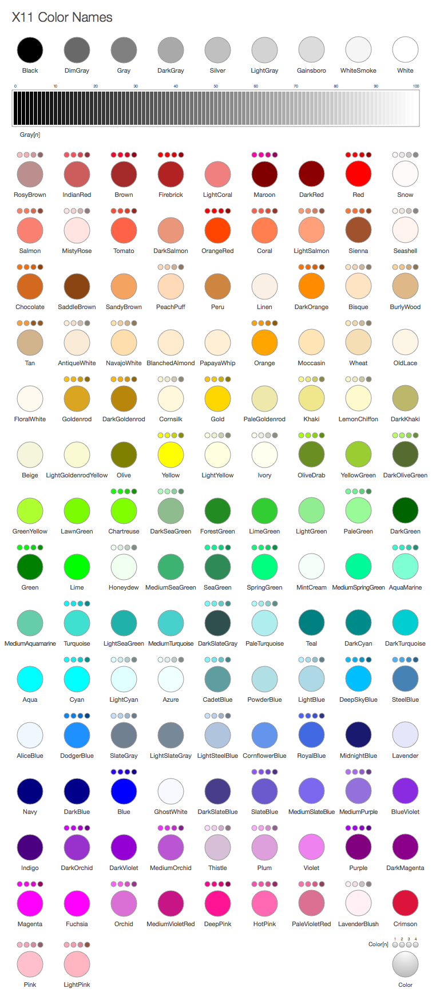

#### Graphviz Engines

Several **Graphviz** engines are available with **DiagrammeR** for rendering graphs. By default, the `grViz` function renders graphs using the standard **dot** engine. However, the **neato**, **twopi**, and **circo** engines are selectable by doing either of the following:

- supplying those names to the `engine` argument of the `grViz` function
- setting the graph attribute `layout` equal to either `neato`, `twopi`, or `circo` in a **Graphviz** graph statement

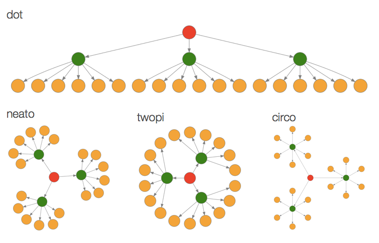

The **neato** engine provides spring model layouts. This is a suitable engine if the graph is not too large (<100 nodes) and you don't know anything else about it. The **neato** engine attempts to minimize a global energy function, which is equivalent to statistical multi-dimensional scaling. The **twopi** engine provides radial layouts. Nodes are placed on concentric circles depending their distance from a given root node. The **circo** engine provide circular layouts. This is suitable for certain diagrams of multiple cyclic structures, such as certain telecommunications networks.

#### Graphviz Substitution

Inspired by **Razor** and the footnote URLs from **Markdown**, substitution allows for mixing in **R** expressions into a **Graphviz** graph specification without sacrificing readability. In the simple example of specifying a single node, the following substitution syntax would be used:

```
digraph {
@@1
}

[1]: 'a'
```

Importantly, the footnote expressions should reside below the closing curly brace of the `graph` or `digraph` expression. It should always take the form of:

`[` + *`[footnote number]`* + `]:`

In the above example, the `[1]:` footnote expression evaluates as `'a'`, and, that is what's substituted at the `@@1` location (where, in turn, it will be taken as the node ID). The substitution construction is:

`@@` + *`[footnote number]`*

Substitutions can also be used to insert values from vector indices into the graph specification. Simply use this format:

`@@` + *`[footnote number]`* + `-` + *`[index number]`*

Here is an example of substituting alphabet letters from **R**'s `LETTERS` constant into a **Graphviz** graph specification.

```
digraph {
alpha
@@1-1; @@1-2; @@1-3; @@1-4; @@1-5
@@1-6; @@1-7; @@1-8; @@1-9; @@1-10
}

[1]: LETTERS
```

After evaluation of the footnote expressions and substitution, the graph specification becomes this:

```
digraph {
alpha
A; B; C; D; E
F; G; H; I; J
}
```

To take advantage of substitution and render the graph, simply use the `grViz` function with the graph specification:

```r
grViz("...graph spec with substitutions...")
```

A mixture of both types of subtitutions can be used. As an example:

```r
grViz("
digraph a_nice_graph {

# node definitions with substituted label text
node [fontname = Helvetica]
a [label = '@@1']
b [label = '@@2-1']
c [label = '@@2-2']
d [label = '@@2-3']
e [label = '@@2-4']
f [label = '@@2-5']
g [label = '@@2-6']
h [label = '@@2-7']
i [label = '@@2-8']
j [label = '@@2-9']

# edge definitions with the node IDs
a -> {b c d e f g h i j}
}

[1]: 'top'
[2]: 10:20
")
```

As can be seen in the following output: (1) the node with ID `a` is given the label `top` (after substituting `@@1` with expression after the `[1]:` footnote expression), (2) the nodes with ID values from `b`-`j` are respectively provided values from indices 1 to 9 (using the hypenated form of `@@`) of the evaluated expression `10:20` (in the `[2]:` footnote expression).

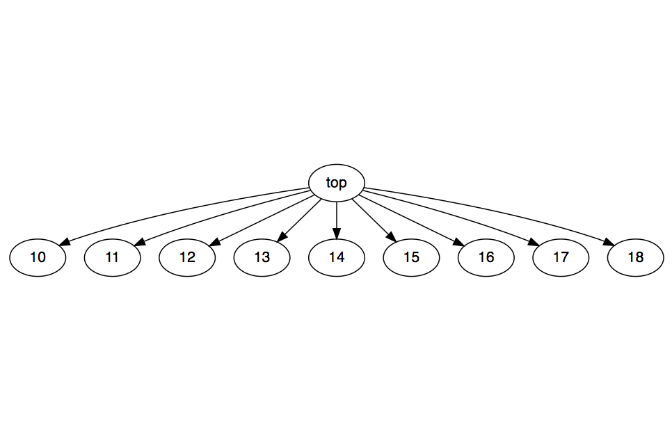

Footnote expressions are meant to be flexible. They can span multiple lines, and they can also take in objects that are available in the global workspace. So long as a vector object results from evaluation, substitution can be performed.

#### Using Functions to Define Graphs

If you're planning on creating larger graph diagrams and also making use of external datasets, it can be better to use a set of **DiagrammeR** functions that work with data frames. Here is a basic schematic of the graph workflow, using functions to build toward a graph object from a group of data frames.

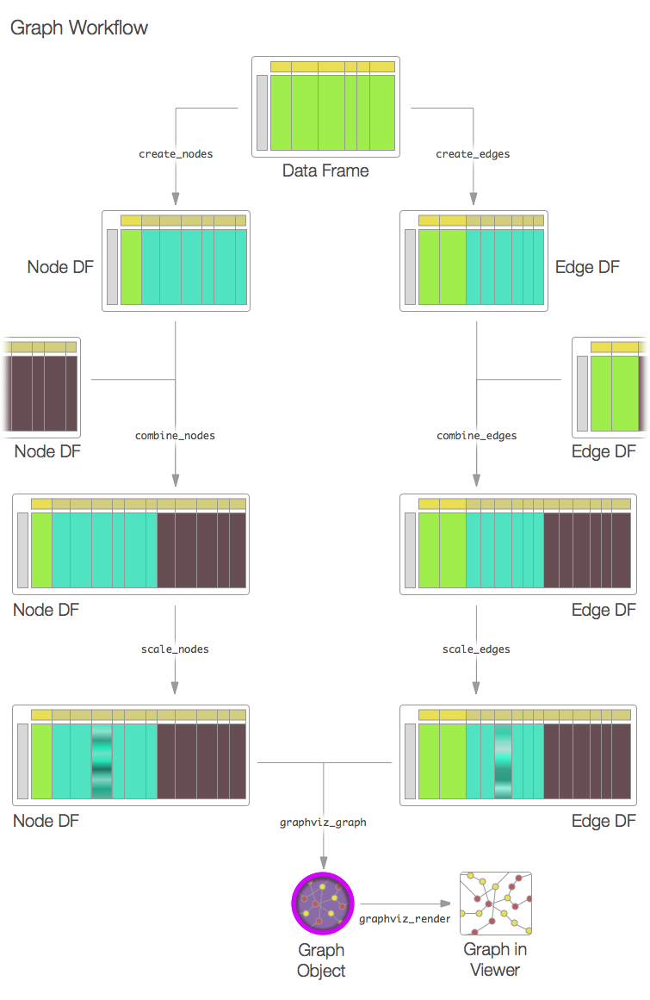

With the `create_graph` function, it's possible to generate a graph diagram object without interacting directly with **DOT** code. The function has the following options:

```r
create_graph(
    nodes_df,     # provide the name of the data frame with node info         
    edges_df,     # provide the name of the data frame with edge info 
    graph_attrs,  # provide a vector of 'graph' attributes
    node_attrs,   # provide a vector of 'node' attributes as defaults
    edge_attrs,   # provide a vector of 'edge' attributes as defaults
    directed      # is the graph to be directed or undirected? Choose TRUE or FALSE
    )
```

The `create_graph` function returns a `gv_graph` object, which can be used by additional processing functions. One such function is the `render_graph` function, which allows for both visualizing the graph object and creating output files:

```r
render_graph(
    graph,        # a 'gv_graph' object, created using the 'create_graph' function
    output,       # a string specifying the output type; 'graph' (the default) renders
                  # the graph, 'DOT' outputs DOT code for the graph, and 'SVG' provides
                  # SVG code for the rendered graph
    width,        # optionally set a width in pixels
    height        # optionally set a height in pixels
    )
```

With packages such as [**magrittr**](https://github.com/smbache/magrittr) or [**pipeR**](https://github.com/renkun-ken/pipeR), one can conveniently pipe output from `create_graph` to `render_graph`. On the topic of packages, it is important to load the [**V8**](https://github.com/jeroenooms/V8) package as it will enable color scaling functionality (as will be seen in later examples).

Before we get to using the `create_graph` and `render_graph` functions, however, we'll need to create some specialized data frames. One is for nodes, the other concerns the edges. Both types of data frames are parsed by the `create_graph` function and those column names that match attributes for either nodes (in the node data frame) or edges (in the edge data frame) will be used to provide attribute values on a per-node or per-edge basis. Columns with names that don't match are disregarded, so, there's no harm in having pre-existing or added columns with useful data for analysis.

Which columns might a node data frame have? Well, it's important to have at least one column named either `node`, `nodes`, or `node_id`. That's where unique values for the node ID should reside. Here are some notable node attributes:

- `color` -- provide an **X11** or hexadecimal color (append 2 digits to hex for alpha)
- `distortion` -- the node distortion for any `shape = polygon`
- `fillcolor` -- provide an **X11** or hexadecimal color (append 2 digits to hex for alpha)
- `fixedsize` -- true or false
- `fontcolor` -- provide an **X11** or hexadecimal color (append 2 digits to hex for alpha)
- `fontname` -- the name of the font
- `fontsize` -- the size of the font for the node label
- `height` -- the height of the node
- `label` -- the node label text that replaces the default text (which is the node ID)
- `penwidth` -- the thickness of the stroke for the shape
- `peripheries` -- the number of peripheries (essentially, additional shape outlines)
- `shape` -- the node shape (e.g., ellipse, polygon, circle, etc.)
- `sides` -- if `shape = polygon`, the number of sides can be provided here
- `style` -- usually given the value `filled` if you'd like to fill a node with a color
- `tooltip` -- provide text here for an unstyled browser tooltip
- `width` -- the width of the node
- `x` -- the x position of the node (requires graph attr `layout = neato` to use)
- `y` -- the y position of the node (requires graph attr `layout = neato` to use)

You don't need to use `data.frame` to make a node data frame: you can use the provided `create_nodes` function. It's similar in principle to the base **R** `data.frame` function except that it adds in the following conveniences for graph diagram work: 

- single values are repeated for *n* number of nodes supplied
- selective setting of attributes (i.e., giving attr values of 3 of 10 nodes, allowing non-set nodes to use defaults or globally set attr values)
- supplying overlong vectors for attributes will result in trimming down to the number of nodes
- setting `label = FALSE` will conveniently result in a non-labeled node

Here's an example of how to create a node data frame:

```r
type_1_nodes <-
  create_nodes(nodes = c("a", "b", "c", "d"),
               label = "type 1",
               style = "filled",
               color = "aqua",
               shape = c("circle", "circle",
                         "triangle", "triangle"))
```

The `type_1_nodes` object is indeed a data frame, and, this is good since it's familar and easy to work with. Note that singly supplied attribute values are repeated throughout:

```
 nodes  label  style color    shape
1    a type 1 filled  aqua   circle
2    b type 1 filled  aqua   circle
3    c type 1 filled  aqua triangle
4    d type 1 filled  aqua triangle
```

Let's make another node data frame:

```r
type_2_nodes <-
  create_nodes(nodes = c("e", "f", "g", "h"),
               label = "type 2",
               style = "filled",
               color = "lightblue",
               peripheries = c(2, 2))
```

Here is the resulting data frame (notice that values for the `peripheries` node attribute are only provided twice):

```
 nodes  label  style     color peripheries
1    e type 2 filled lightblue           2
2    f type 2 filled lightblue           2
3    g type 2 filled lightblue
4    h type 2 filled lightblue
```

Now that we have these groups of nodes in `type_1_nodes` and `type_2_nodes`, there may be occasion to combine them into a single node data frame. This can be done with the `combine_nodes` function (which works much like `rbind` except it accepts data frames with columns differing in number, names, and ordering).

```r
all_nodes <- combine_nodes(type_1_nodes, type_2_nodes)
```

This is the combined node data frame:

```
 nodes  label  style     color    shape peripheries
1    a type 1 filled      aqua   circle
2    b type 1 filled      aqua   circle
3    c type 1 filled      aqua triangle
4    d type 1 filled      aqua triangle
5    e type 2 filled lightblue                    2
6    f type 2 filled lightblue                    2
7    g type 2 filled lightblue
8    h type 2 filled lightblue
```

Let's look at the nodes that were created. Use the `create_graph` (just provide the `all_nodes` object at this point) and pipe to `render_graph`. The **pipeR** package (used in these examples) provides a forward pipe with the `%>>%` operator. With **magrittr**, use `%>%` instead.

```r
library("pipeR")

create_graph(nodes_df = all_nodes) %>>% render_graph
```

This is what the diagram looks like, at this early stage:

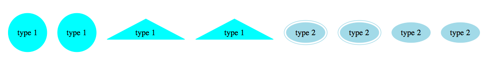

Want to extract a vector list of node IDs? You can use the `get_nodes` function. It can accept multiple node data frames, edge data frames, or graph objects.

```r
get_nodes(all_nodes)
```

```
[1] "a" "b" "c" "d" "e" "f" "g" "h"
```

Let's make some edges now. For the edge data frame, there are two columns that need to be present: one for the outgoing node edge, and, another for the incoming node edge. These can be called either `edge_from`, `from`, `edge_to`, or `to`. Each of the two columns should contain node IDs and, ideally, they should match those provided in the node data frame that will be supplied to the `create_graph` function.

As in the nodes data frame, attributes can be provided. Here are some examples of edge attributes that can be used:

- `arrowhead` -- the arrow style at the head end (e.g, `normal`, `dot`) 
- `arrowsize` -- the scaling factor for the arrowhead and arrowtail
- `arrowtail` -- the arrow style at the tail end (e.g, `normal`, `dot`) 
- `color` -- the stroke color; an **X11** color or a hex code (add 2 digits for alpha)
- `dir` -- the direction; either `forward`, `back`, `both`, or `none`
- `fontcolor` -- choose an **X11** color or provide a hex code (append 2 digits for alpha)
- `fontname` -- the name of the font
- `fontsize` -- the size of the font for the node label
- `headport` -- a cardinal direction for where the arrowhead meets the node
- `label` -- label text for the line between nodes
- `minlen` -- minimum rank distance between head and tail 
- `penwidth` -- the thickness of the stroke for the arrow
- `tailport` -- a cardinal direction for where the tail is emitted from the node
- `tooltip` -- provide text here for an edge tooltip

Let's create some edges between nodes using the `create_edges` function:

```r
type_1_edges <-
  create_edges(edge_from = c("a", "a", "b", "c"),
               edge_to = c("b", "d", "d", "a"))

type_2_edges <-
  create_edges(edge_from = c("e", "g", "h", "h"),
               edge_to = c("g", "h", "f", "e"),
               arrowhead = "dot",
               color = "red")
```

Two edge data frames were just created. If you'd like to include all those edges in your graph, just use the `combine_edges` function:

```r
all_edges <- combine_edges(type_1_edges, type_2_edges)
```

Very nice, now we have graph-able node and edge data frames. Let's just go ahead and incorporate those edges into the `create_graph` function and then see what that graph looks like:

```r
create_graph(nodes_df = all_nodes,
               edges_df = all_edges) %>>% render_graph
```


Not bad for an example graph. There may be cases where node or edge attributes should apply to all nodes and edges in the graph. In such cases, there's no need to create columns for those attributes where attribute values are repeated in all rows. Instead, supply vectors of attribute statements for the `node_attrs` or `edge_attrs` arguments in the `create_graph` function. For example, you may want to use `Helvetica` as the label font. If so, use this in `create_graph`:

```r
create_graph(nodes_df = all_nodes,
               edges_df = all_edges,
               node_attrs = "fontname = Helvetica") %>>% render_graph
```

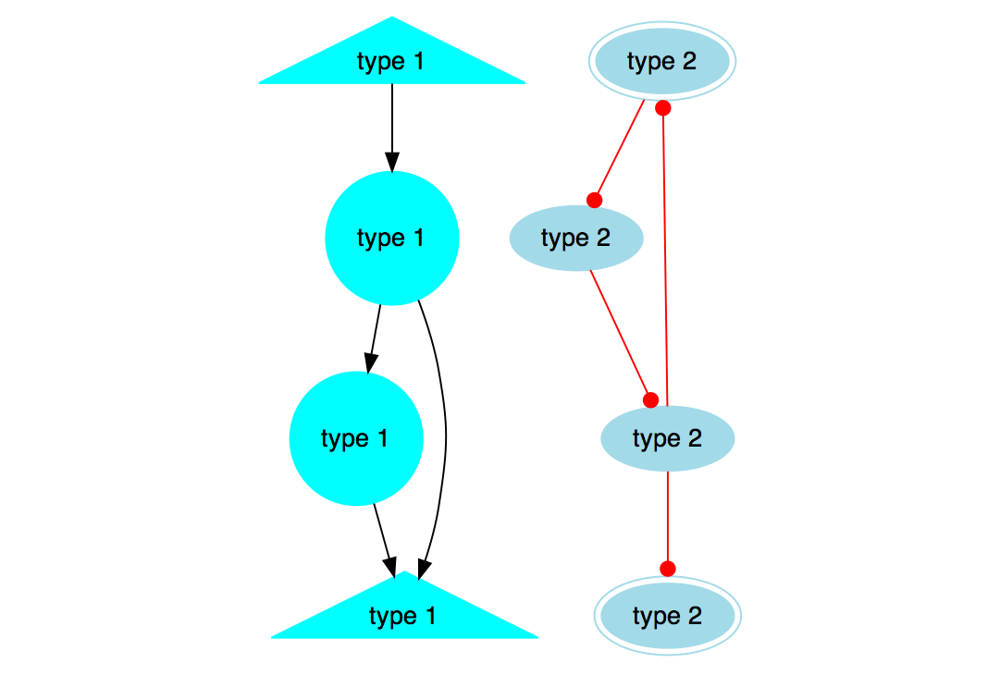

Likewise, for edges, you may want a certain uniform look that is different from the defaults. Perhaps, a grey line which has a thicker line stroke:

```r
create_graph(nodes_df = all_nodes,
               edges_df = all_edges,
               node_attrs = "fontname = Helvetica",
               edge_attrs = c("color = gray", "penwidth = 4")) %>>% render_graph
```

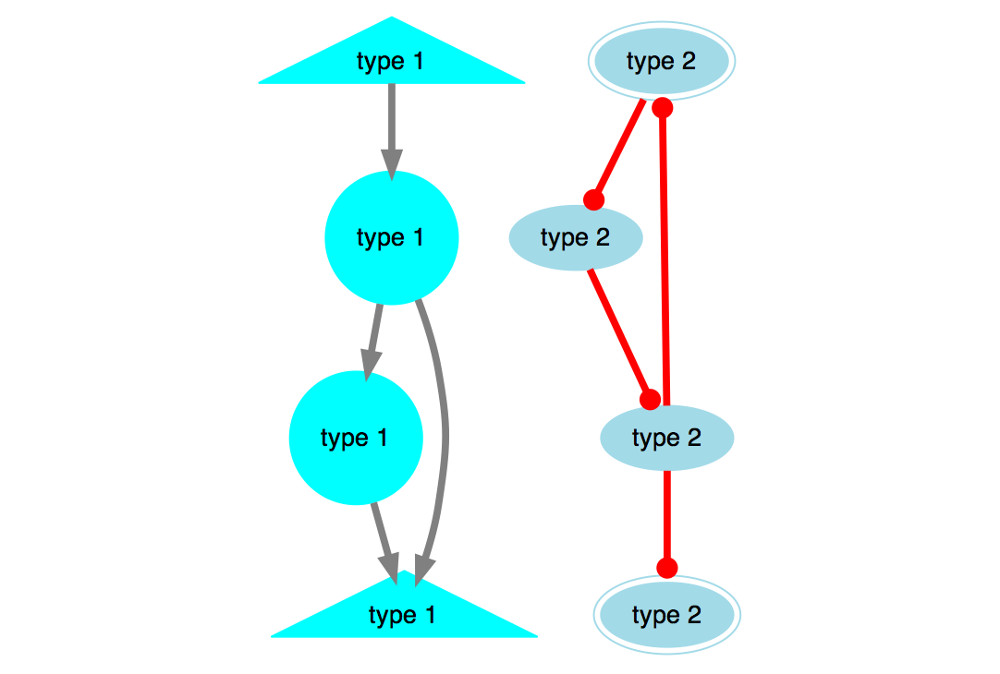

The graph attributes can be set in a similar manner by supplying a vector to the `graph_attrs` argument. Here's an example where the layout engine is set to `circo`, node overlapping is suppressed, the separation between nodes is of factor 3, and the edges are drawn first (so as to not obscure the nodes):

```r
create_graph(nodes_df = all_nodes,
               edges_df = all_edges,
               node_attrs = "fontname = Helvetica",
               edge_attrs = c("color = gray", "penwidth = 4"),
               graph_attrs = c("layout = circo",
                               "overlap = false",
                               "ranksep = 3",
                               "outputorder = edgesfirst")) %>>% render_graph
```

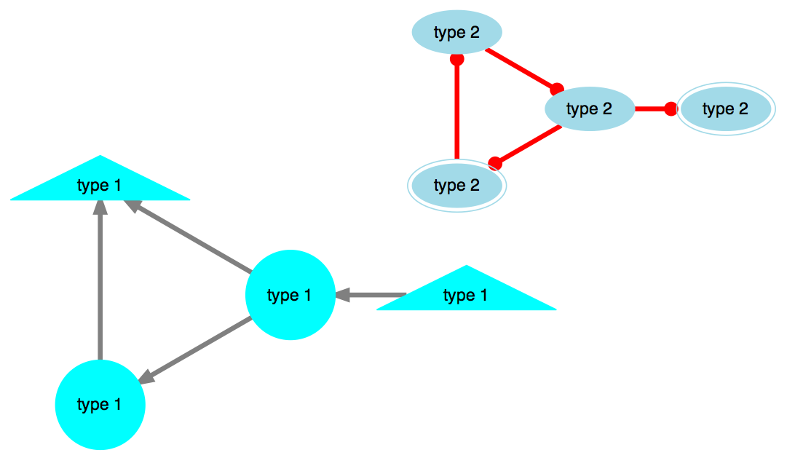

#### Creating Numeric and Color Scales for Node and Edge Attributes

With the `scale_nodes` and `scale_edges` functions, it's possible to create and apply scaled node and edge attributes. These attributes can be either of the numeric or color variety. Ideally, the numerical data from which the scaled values are generated should reside in the node or edge data frames. This is recommended because the values need to be of the same length and order as the records in the node or edge data frame.

For nodes, scales can be made for the following attributes:

- `fontsize` *numeric*
- `labelfontsize` *numeric*
- `penwidth` *numeric*
- `height` *numeric*
- `weight` *numeric*
- `x` *numeric*
- `y` *numeric*
- `color` *color*
- `fillcolor` *color*
- `fontcolor` *color*

For edges, scales can be made for the following edge attributes:

- `fontsize` *numeric*
- `labelfontsize` *numeric*
- `labelangle` *numeric*
- `labeldistance` *numeric*
- `penwidth` *numeric*
- `arrowsize` *numeric*
- `minlen` *numeric*
- `weight` *numeric*
- `color` *color*
- `fontcolor` *color*
- `labelfontcolor` *color*

There is also another attribute for both nodes and edges called `alpha` which is a numeric value from `0`-`100` that modifies the opacity of a specified color attribute. A value of `0` is essentially invisible (i.e., completely transparent) whereas `100` is entirely opaque (i.e., no transparency applied). Creating an alpha scale can be done by either referencing a column containing color attribute values, or, by initializing a color attribute column and then creating an alpha scale at the same time. An example will be useful here, and **RStudio Viewer** output will be shown here after significant changes to the graph. Begin by randomly creating edges and nodes with static attributes:

```r
# Setting a seed to make the example reproducible
set.seed(23)

# Create an edge data frame and also include a column of 'random' data
many_edges <-
  create_edges(edge_from = sample(seq(1:100), 100, replace = TRUE),
               edge_to = sample(seq(1:100), 100, replace = TRUE),
               random_data = sample(seq(1:5000), 100, replace = TRUE))

# Create the node data frame, using the nodes that are available in
# the 'many_edges' data frame; provide 'shape' and 'fillcolor' attributes
many_nodes <-
  create_nodes(node = get_nodes(many_edges),
               random_data = sample(seq(1:5000),
                                    length(get_nodes(many_edges))),
               label = FALSE,
               shape = "circle",
               fillcolor = "red")
```

View the graph and also ensure that `style = filled` is present to activate the `fillcolor` node attribute. This statement will be used repeatedly throughout without changing any of the argument values.

```r
create_graph(nodes_df = many_nodes, edges_df = many_edges,
               node_attrs = "style = filled",
               graph_attrs = c("layout = twopi", "overlap = false")) %>>%
  render_graph
```


Create a scale for the node attribute `penwidth` (which changes the stroke thickness of the node shape). Using the data in the `random_data`, those values will be scaled linearly from `2` to `10`. 
 
```r
many_nodes <- scale_nodes(nodes_df = many_nodes,
                          to_scale = many_nodes$random_data,
                          node_attr = "penwidth",
                          range = c(2, 10))
```


To apply transparency to color values, use the `alpha` node attribute but reference the color attribute that should be modified with the syntax: '`alpha:`[color_attr]'. If the referenced color attribute doesn't exist, use the following syntax: '`alpha:`[color_attr]`=`[color]'. The color value can either be an **X11** color name or a hexadecimal color value.

```r
many_nodes <- scale_nodes(nodes_df = many_nodes,
                          to_scale = many_nodes$random_data,
                          node_attr = "alpha:fillcolor",
                          range = c(5, 90))
```

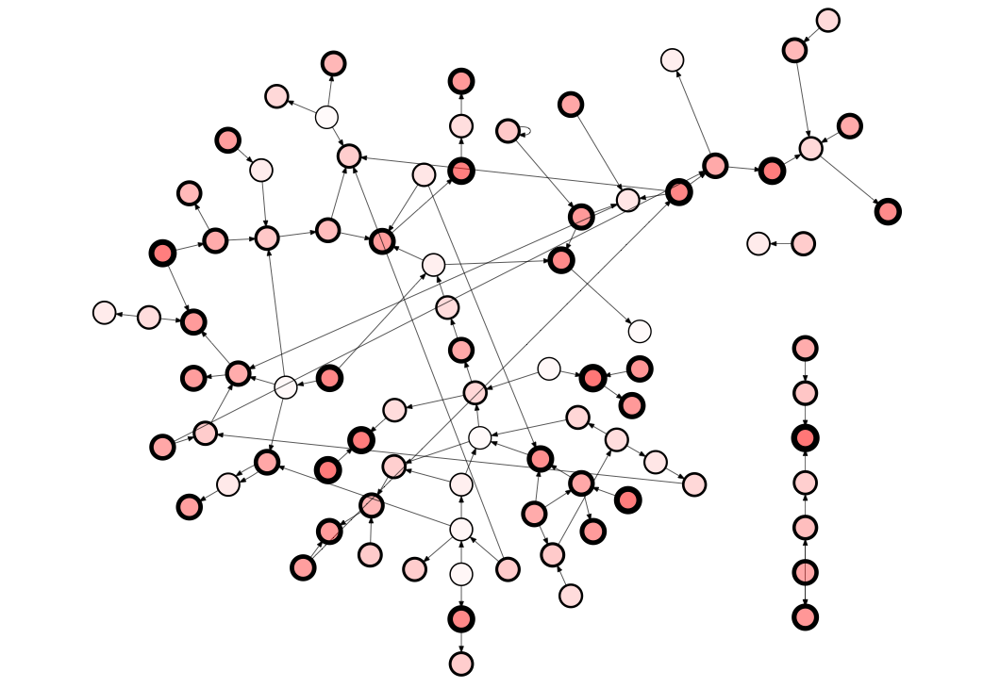

Edges can have scales applied to edge attributes:

```r
many_edges <- scale_edges(edges_df = many_edges,
                          to_scale = many_edges$random_data,
                          edge_attr = "penwidth",
                          range = c(0.5, 10))
```


You can linearly scale color values as well. When creating color scales, ensure that the **V8** library is installed and loaded.

```r
# install.packages("V8")
library("V8")
many_edges <- scale_edges(edges_df = many_edges,
                          to_scale = many_edges$penwidth,
                          edge_attr = "color",
                          range = c("red", "green"))
```


#### Exporting Graph Code

If you'd like to return the **Graphviz** **DOT** code (to, perhaps, share it or use it directly with the **Graphviz** command-line utility), just use `output = "DOT"` in the `render_graph` function. Here's a simple example:

```r
create_graph(nodes_df = data.frame(nodes = c("a", "b", "c")),
               edges_df = data.frame(edge_from = c("a", "b", "c"),
                                     edge_to = c("b", "c", "b")),
               graph_attrs = c("layout = dot", "rankdir = LR"),
               node_attrs = "fontname = Helvetica",
               edge_attrs = "arrowhead = dot") %>>%
  render_graph(output = "DOT") %>>% cat
```

The output is pretty clean **DOT** code:

```
digraph {

graph [layout = dot,
       rankdir = LR]

node [fontname = Helvetica]

edge [arrowhead = dot]

  'a'
  'b'
  'c'
  'a'->'b' 
  'b'->'c' 
  'c'->'b' 
}
```

What about **SVG**s? Those are the things you should eat for breakfast, every day. Well, you can get those out as well. It's all part of maintaining a balanced diet:

```r
# install.packages("V8")
library("V8")

create_graph(nodes_df = data.frame(nodes = c("a", "b", "c")),
               edges_df = data.frame(edge_from = c("a", "b", "c"),
                                     edge_to = c("b", "c", "b")),
               graph_attrs = c("layout = dot", "rankdir = LR"),
               node_attrs = "fontname = Helvetica",
               edge_attrs = "arrowhead = dot") %>>%
  render_graph(output = "SVG") %>>% cat             
```

The **SVG**:

```html
<?xml version="1.0" encoding="UTF-8" standalone="no"?>
<!DOCTYPE svg PUBLIC "-//W3C//DTD SVG 1.1//EN"
 "http://www.w3.org/Graphics/SVG/1.1/DTD/svg11.dtd">
<!-- Generated by graphviz version 2.28.0 (20140111.2315)
 -->
<!-- Title: %3 Pages: 1 -->
<svg width="100pt" height="182pt"
 viewBox="0.00 0.00 100.20 181.58" xmlns="http://www.w3.org/2000/svg" xmlns:xlink="http://www.w3.org/1999/xlink">
<g id="graph0" class="graph" transform="scale(1 1) rotate(0) translate(4 177.583)">
<title>%3</title>
<polygon fill="white" stroke="none" points="-4,4 -4,-177.583 96.196,-177.583 96.196,4 -4,4"/>
<!-- a -->
<g id="node1" class="node"><title>a</title>
<ellipse fill="none" stroke="black" cx="65.196" cy="-155.583" rx="27" ry="18"/>
<text text-anchor="middle" x="65.196" y="-151.383" font-family="Helvetica,sans-Serif" font-size="14.00">a</text>
</g>
<!-- b -->
<g id="node2" class="node"><title>b</title>
<ellipse fill="none" stroke="black" cx="56.8918" cy="-83.7744" rx="27" ry="18"/>
<text text-anchor="middle" x="56.8918" y="-79.5744" font-family="Helvetica,sans-Serif" font-size="14.00">b</text>
</g>
<!-- a&#45;&gt;b -->
<g id="edge1" class="edge"><title>a&#45;&gt;b</title>
<path fill="none" stroke="black" d="M63.1005,-137.462C62.2124,-129.782 61.1563,-120.65 60.1692,-112.115"/>
<polygon fill="black" stroke="black" points="63.6412,-111.67 59.0155,-102.139 56.6875,-112.475 63.6412,-111.67"/>
</g>
<!-- c -->
<g id="node3" class="node"><title>c</title>
<ellipse fill="none" stroke="black" cx="27" cy="-18" rx="27" ry="18"/>
<text text-anchor="middle" x="27" y="-13.8" font-family="Helvetica,sans-Serif" font-size="14.00">c</text>
</g>
<!-- b&#45;&gt;c -->
<g id="edge2" class="edge"><title>b&#45;&gt;c</title>
<path fill="none" stroke="black" d="M55.1245,-65.7706C52.7511,-58.6375 49.2809,-50.3357 45.5321,-42.6655"/>
<polygon fill="black" stroke="black" points="48.6057,-40.9899 40.8762,-33.7437 42.3999,-44.2284 48.6057,-40.9899"/>
</g>
<!-- c&#45;&gt;b -->
<g id="edge3" class="edge"><title>c&#45;&gt;b</title>
<path fill="none" stroke="black" d="M28.7673,-36.0038C31.1407,-43.1368 34.6109,-51.4386 38.3597,-59.1089"/>
<polygon fill="black" stroke="black" points="35.2861,-60.7845 43.0155,-68.0306 41.4919,-57.5459 35.2861,-60.7845"/>
</g>
</g>
</svg>
```

#### An Example with Data from the **nycflights13** Package

Now, yet another example. This time with an external dataset. Let's use the **nycflights13** package to prepare some data frames and then create a graph diagram:

```r
# Get the 'nycflights13' package if not already installed
# install.packages('nycflights13')
 
# Get the 'lubridate' package if not already installed
# install.packages('lubridate')
 
# Get the latest build of the 'DiagrammeR' package from GitHub
devtools::install_github('rich-iannone/DiagrammeR')
 
library("nycflights13")
library("lubridate")
library("DiagrammeR")
library("pipeR")
 
# Choose a day from 2013 for NYC flight data
# (You can choose any Julian day, it's interesting to see results for different days)
day_of_year <- 10 

# Get a data frame of complete cases (e.g., flights have departure and arrival times)
nycflights13 <-
  nycflights13::flights[which(complete.cases(nycflights13::flights) == TRUE), ]

# Generate a POSIXct vector of dates using the 'ISOdatetime' function
# Columns 1, 2, and 3 are year, month, and day columns
# Column 4 is a 4-digit combination of hours (00-23) and minutes (00-59)
date_time <-
  data.frame("date_time" =
               ISOdatetime(year = nycflights13[,1],
                           month = nycflights13[,2],
                           day = nycflights13[,3],
                           hour = gsub("[0-9][0-9]$", "", nycflights13[,4]),
                           min = gsub(".*([0-9][0-9])$", "\\1", nycflights13[,4]),
                           sec = 0, tz = "GMT"))

# Add the POSIXct vector 'date_time' to the 'nycflights13' data frame
nycflights13 <- cbind(date_time, nycflights13)

# Select flights only from the specified day of the year 2013
nycflights13_day <-
  subset(nycflights13,
         date_time >= ymd('2013-01-01', tz = "GMT") + days(day_of_year - 1) &
           date_time < ymd('2013-01-01', tz = "GMT") + days(day_of_year))

# Create the 'nodes' data frame where at least one column is named "nodes" or "node_id"
# Column 12 is the 3-letter code for the airport departing from
# Column 13 is for the airport arriving to
# (Option: change df to 'nycflights13_day' and only airports used for the day will be included)
nodes_df <- create_nodes(nodes = unique(c(nycflights13[,12],
                                    nycflights13[,13])),
                         label = FALSE)

# The 'edges' data frame must have columns named 'edge_from' and 'edge_to'
# The color attribute is determined with an 'ifelse' statement, where
# column 8 is the minutes early (negative values) or minutes late (positive values)
# for the flight arrival
edges_df <- create_edges(edge_from = nycflights13_day[,12],
                         edge_to = nycflights13_day[,13],
                         color = ifelse(nycflights13_day[,8] < 0,
                                    "green", "red"))

# Set the graph diagram's default attributes for...

# ...nodes
node_attrs <- c("style = filled", "fillcolor = lightblue",
                "color = gray", "shape = circle", "fontname = Helvetica",
                "width = 1")

# ...edges
edge_attrs <- c("arrowhead = dot")

# ...and the graph itself
graph_attrs <- c("layout = circo",
                 "overlap = false",
                 "fixedsize = true",
                 "ranksep = 3",
                 "outputorder = edgesfirst")

# Generate the graph diagram in the RStudio Viewer.
# The green lines show flights that weren't late (red indicates late arrivals)
# This graph is for a single day of flights, airports that are unconnected on a
# given day may be destinations on another day
create_graph(nodes_df = nodes_df, edges_df = edges_df,
               graph_attrs = graph_attrs, node_attrs = node_attrs,
               edge_attrs = edge_attrs, directed = TRUE) %>>%
  render_graph(width = 1200, height = 800)
               
```

This outputs the following graph in the **RStudio** Viewer:


### Mermaid Diagrams

The `mermaid` function processes the specification of a diagram and then renders the diagram. This diagram spec can either exist in the form of a string, a reference to a mermaid file (with a **.mmd** file extension), or as a connection. 

The **mermaid**-style graph specification begins with a declaration of `graph` followed by the graph direction. The directions can be:

- `LR` left to right
- `RL` right to left
- `TB` top to bottom
- `BT` bottom to top
- `TD` top down (same as `TB`)

Nodes can be given arbitrary ID values and those IDs are displayed as text within their respective boxes. Connections between nodes are denoted by:

- `-->` arrow connection
- `---` line connection

Simply joining up a series of nodes in a left-to-right graph can be done in a few lines:

```r
diagram <- "
graph LR
  A-->B
  A-->C
  C-->E
  B-->D
  C-->D
  D-->F
  E-->F
"

mermaid(diagram)
```

This renders the following image:

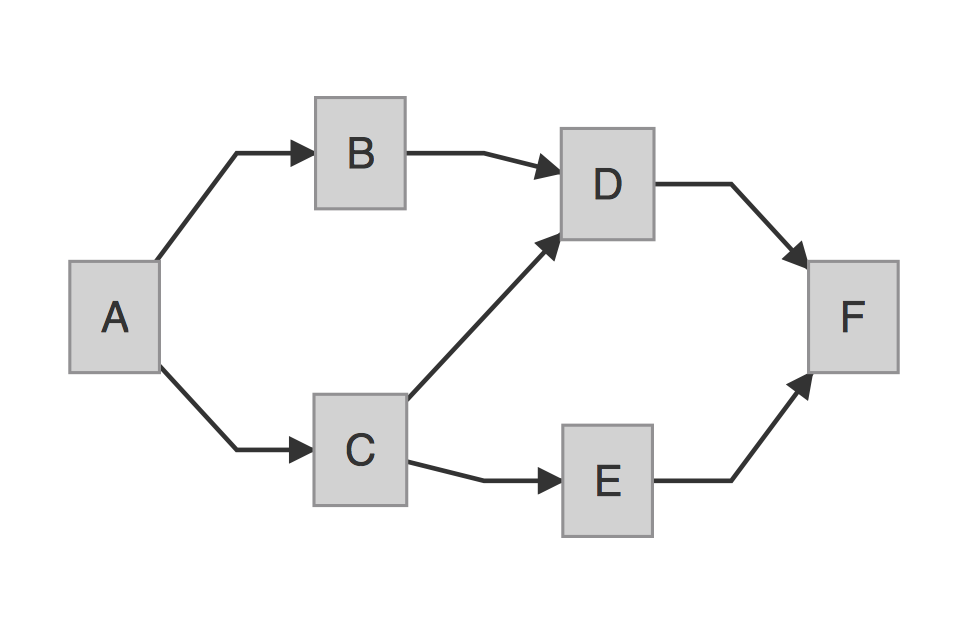

The same result can be achieved in a more succinct manner with this **R** statement (using semicolons between statements in the **mermaid** diagram spec):

```r
mermaid("graph LR; A-->B; A-->C; C-->E; B-->D; C-->D; D-->F; E-->F")
```

Alternatively, here is the result of using the statement `graph TB` in place of `graph LR`:

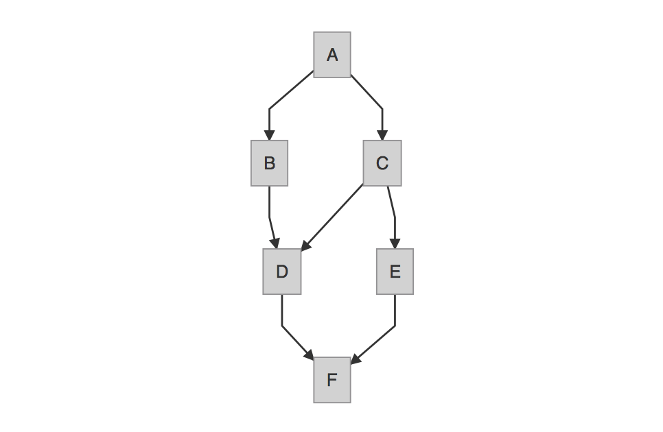

Keep in mind that external files can also be called by the `mermaid` function. The file `graph.mmd` can contain the text of the diagram spec as follows

```
graph LR
  A-->B
  A-->C
  C-->E
  B-->D
  C-->D
  D-->F
  E-->F
```

and be rendered through:

```r
mermaid("graph.mmd")
```

Alright, here's another example. This one places some text inside the diagram objects. Also, there are some CSS styles to add a color fill to each of the diagram objects:

```r
diagram <- "
graph LR
A(Rounded)-->B[Squared]
B-->C{A Decision}
C-->D[Square One]
C-->E[Square Two]
    
style A fill:#DCEBE3
style B fill:#77DFC9
style C fill:#DEDBBA
style D fill:#F8F0CC
style E fill:#FCFCF2
"
    
mermaid(diagram)
```

What you get is this:

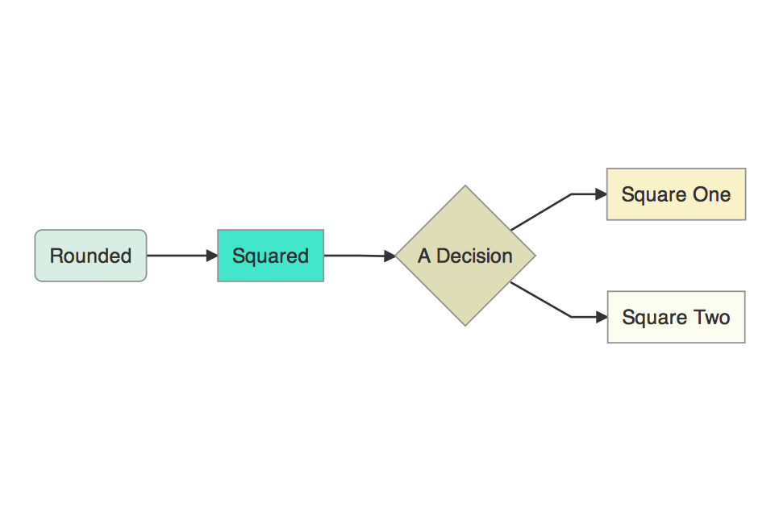

Here's an example with line text (that is, text appearing on connecting lines). Simply place text between pipe characters, just after the arrow, right before the node identifier. There are few more CSS properties for the boxes included in this example (`stroke`, `stroke-width`, and `stroke-dasharray`).

```r
diagram <- "
graph BT
A(Start)-->|Line Text|B(Keep Going)
B-->|More Line Text|C(Stop)
    
style A fill:#A2EB86, stroke:#04C4AB, stroke-width:2px
style B fill:#FFF289, stroke:#FCFCFF, stroke-width:2px, stroke-dasharray: 4, 4
style C fill:#FFA070, stroke:#FF5E5E, stroke-width:2px
"

mermaid(diagram)
```

The resultant graphic:

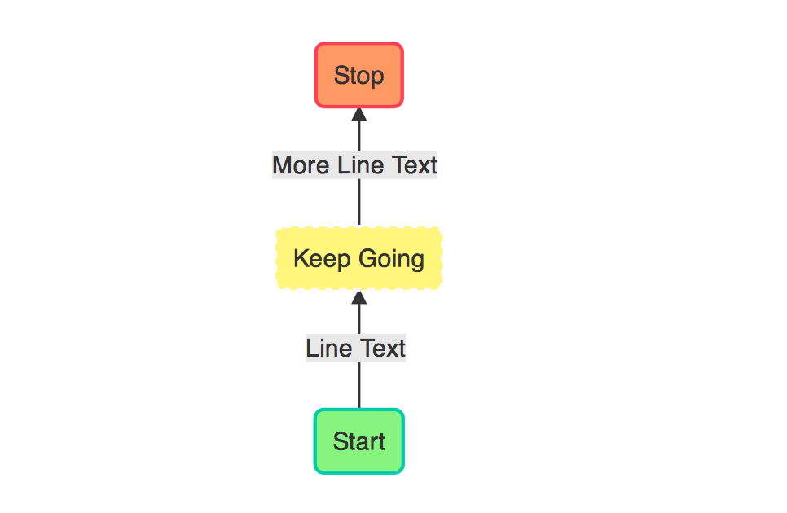

Let's include the values of some **R** objects into a fresh diagram. The `mtcars` dataset is something I go to again and again, so, I'm going to load it up.

```r
data(mtcars)
```

When you call the **R** `summary` function on this data frame, you obtain this:

```
     mpg             cyl             disp             hp             drat      
 Min.   :10.40   Min.   :4.000   Min.   : 71.1   Min.   : 52.0   Min.   :2.760  
 1st Qu.:15.43   1st Qu.:4.000   1st Qu.:120.8   1st Qu.: 96.5   1st Qu.:3.080  
 Median :19.20   Median :6.000   Median :196.3   Median :123.0   Median :3.695  
 Mean   :20.09   Mean   :6.188   Mean   :230.7   Mean   :146.7   Mean   :3.597  
 3rd Qu.:22.80   3rd Qu.:8.000   3rd Qu.:326.0   3rd Qu.:180.0   3rd Qu.:3.920  
 Max.   :33.90   Max.   :8.000   Max.   :472.0   Max.   :335.0   Max.   :4.930  
       wt             qsec             vs               am              gear      
 Min.   :1.513   Min.   :14.50   Min.   :0.0000   Min.   :0.0000   Min.   :3.000  
 1st Qu.:2.581   1st Qu.:16.89   1st Qu.:0.0000   1st Qu.:0.0000   1st Qu.:3.000  
 Median :3.325   Median :17.71   Median :0.0000   Median :0.0000   Median :4.000  
 Mean   :3.217   Mean   :17.85   Mean   :0.4375   Mean   :0.4062   Mean   :3.688  
 3rd Qu.:3.610   3rd Qu.:18.90   3rd Qu.:1.0000   3rd Qu.:1.0000   3rd Qu.:4.000  
 Max.   :5.424   Max.   :22.90   Max.   :1.0000   Max.   :1.0000   Max.   :5.000  
      carb      
 Min.   :1.000  
 1st Qu.:2.000  
 Median :2.000  
 Mean   :2.812  
 3rd Qu.:4.000  
 Max.   :8.000 
```

That information can placed into a diagram. First, we'll get a vector object for strings that specify each of the connections and the text inside the boxes (one for each `mtcars` dataset column). These strings will contain each of the statistics provided by the `summary` function (minimum, 1st quartile, median, mean, 3rd quartile, and maximum). We'll use a `sapply` to loop through each column.

```r
connections <- sapply(
  1:ncol(mtcars)
  , function(i){
    paste0(
      i
      , "(", colnames(mtcars)[i], ")---"
      , i, "-stats("
      , paste0(
        names(summary(mtcars[,i]))
        , ": "
        , unname(summary(mtcars[,i]))
        , collapse="<br/>"
      )
      , ")"
    )
  }
)
``` 

This generates all of the syntax required for connections between column names to the statistical summary text in each of the adjoining boxes. Notice the use of the `<br/>` tag that terminates each of the stats inside the `paste0` statement. They provide the necessary linebreaks for text within each diagram object.

Now, to generate the code for the summary diagram, one can use a `paste0` statement and then a separate `paste` statement for the connection text (with the `collapse` argument set to `\n` to specify a linebreak for the output text). Note that within the `paste0` statement, there is a `\n` linebreak wherever you would need one. Finally, to style multiple objects, a `classDef` statement was used. Here, a class of type `column` was provided with values for certain CSS properties. On the final line, the `class` statement applied the class definition to nodes 1 through 11 (a comma-separated list generated by the `paste0` statement). 

```r
diagram <-
paste0(
"graph TD;", "\n",
paste(connections, collapse = "\n"), "\n",
"classDef column fill:#0001CC, stroke:#0D3FF3, stroke-width:1px;" ,"\n",
"class ", paste0(1:length(connections), collapse = ","), " column;
")

mermaid(diagram)
```

This is the resulting graphic:

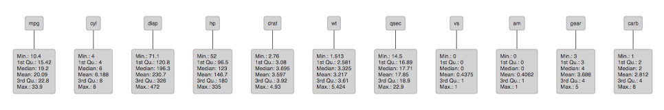

[Sequence diagrams](http://knsv.github.io/mermaid/sequenceDiagram.html) can be generated. The ["How to Draw Sequence Diagrams"](http://www.cs.uku.fi/research/publications/reports/A-2003-1/page91.pdf) report by Poranen, Makinen, and Nummenmaa offers a good introduction to sequence diagrams. Here's an example:

```r
# Using this "How to Draw a Sequence Diagram" 
# http://www.cs.uku.fi/research/publications/reports/A-2003-1/page91.pdf
# draw some sequence diagrams with DiagrammeR

mermaid("
sequenceDiagram
  Customer->>Ticket Seller: Ask for a Ticket
  Ticket Seller->>Database: Seats
  alt Tickets Are Available
    Database->>Ticket Seller: OK
    Ticket Seller->>Customer: Confirm
    Customer->>Ticket Seller: OK
    Ticket Seller->>Database: Book a Seat
    Ticket Seller->>Printer: Print a Ticket
  else Sold Out
    Database->>Ticket Seller: None Left
    Ticket Seller->>Customer: Sorry!
  end
")
```

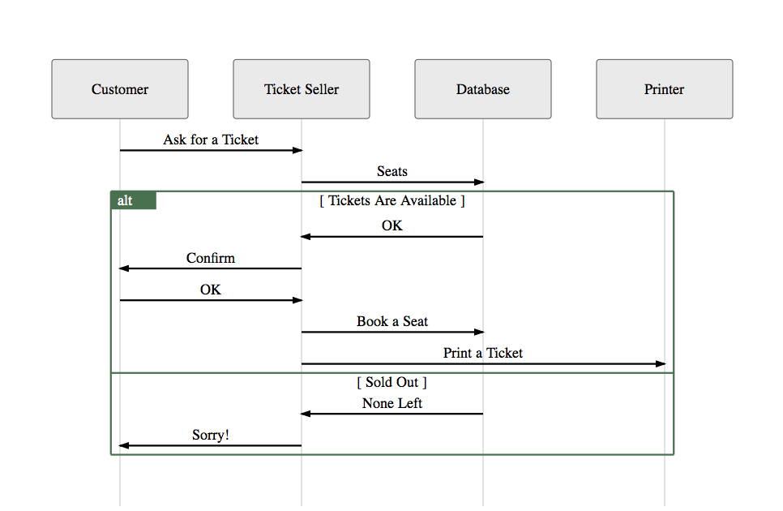

Gantt diagrams can also be generated. Here is an example of how to generate that type of project management diagram:

```r
mermaid("
gantt
dateFormat  YYYY-MM-DD
title A Very Nice Gantt Diagram

section Basic Tasks
This is completed                   :done,          first_1,    2014-01-06, 2014-01-08
This is active                      :active,        first_2,    2014-01-09, 3d
Do this later                       :               first_3,    after first_2, 5d
Do this after that                  :               first_4,    after first_3, 5d

section Important Things
Completed, critical task            :crit, done,    import_1,   2014-01-06,24h
Also done, also critical            :crit, done,    import_2,   after import_1, 2d
Doing this important task now       :crit, active,  import_3,   after import_2, 3d
Next critical task                  :crit,          import_4,   after import_3, 5d

section The Extras
First extras                        :active,        extras_1,   after import_4,  3d
Second helping                      :               extras_2,   after extras_1, 20h
More of the extras                  :               extras_3,   after extras_1, 48h

section The Wrap Up
Congratulations                     :               wrap_1,     after extras_3, 3d
Some meetings                       :                           5d
Additional meetings with cake       :                           18h
")
```


### DiagrammeR + Shiny

As with other **htmlwidgets**, we can easily dynamically bind **DiagrammeR** in **R** with **shiny**. Both `grViz` and `mermaid` (see table below) work with **Shiny**.

Using `grViz` with [`shinyAce`](https://github.com/trestletech/shinyAce), we can easily get an interactive playground for our **Graphviz** diagram.


```r
library(shiny)
library(shinyAce)

ui <- shinyUI(fluidPage(fluidRow(
  column(
    width = 4
    , aceEditor("ace", value = "graph {}")
  ),
  column(
    width = 6
    , grVizOutput('diagram')
  )
)))

server <- function(input, output){
  output$diagram <- renderGrViz({
    grViz(
      input$ace
    )
  })
}

shinyApp(ui = ui, server = server)
```

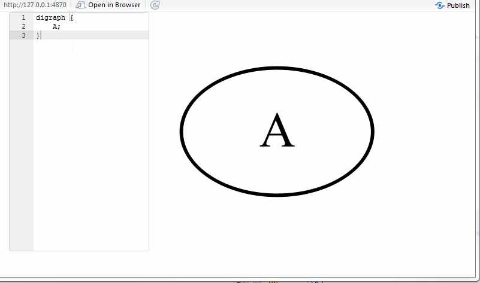

Here is a quick example where we can provide a **mermaid** diagram spec in a `textInput`.

```r
library(shiny)

ui = shinyUI(fluidPage(
  textInput('spec', 'Diagram Spec', value = ""),
  DiagrammeROutput('diagram')
))

server = function(input, output){
  output$diagram <- renderDiagrammeR(DiagrammeR(
    input$spec
  ))
}

shinyApp(ui = ui, server = server)
```

Not all browsers are currently compatible with the **DiagrammeR** **mermaid** **Shiny** app. The following table provides the status for a selection of current browsers.

|Browser/Version             | Platform                       | Status           |
|:---------------------------|:-------------------------------|:-----------------|
|IE 8                        | Windows                        | not working      |
|IE 9                        | Windows                        | not working      |
|IE 10                       | Windows                        | not working      |
|IE 11                       | Windows                        | not working      |
|Safari                      | Windows                        | not working      |
|Safari                      | Mac                            | not working      |
|RStudio Viewer              | Windows                        | not working      |
|RStudio Viewer              | Mac                            | not working      |
|Firefox                     | Windows                        | working          |
|Firefox                     | Mac                            | working          |
|Chrome                      | Windows                        | working          |
|Chrome                      | Mac                            | working          |

