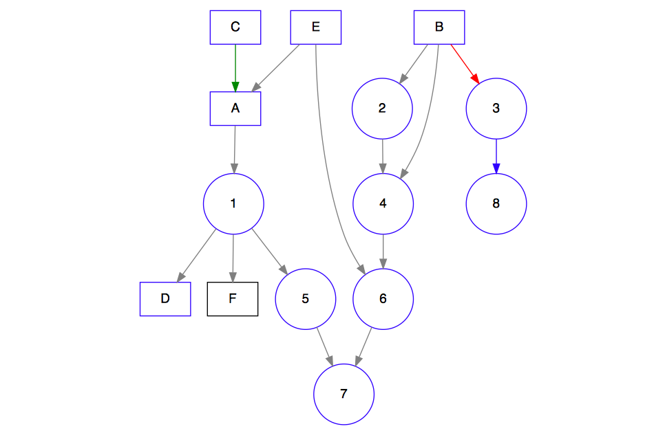
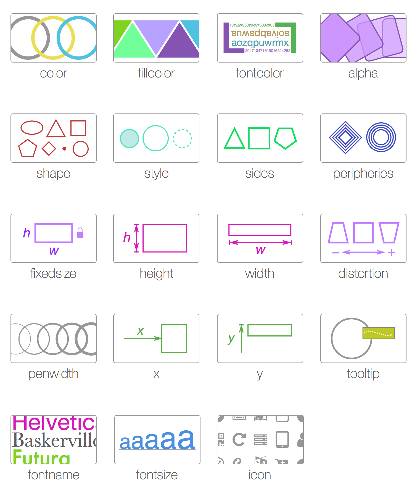
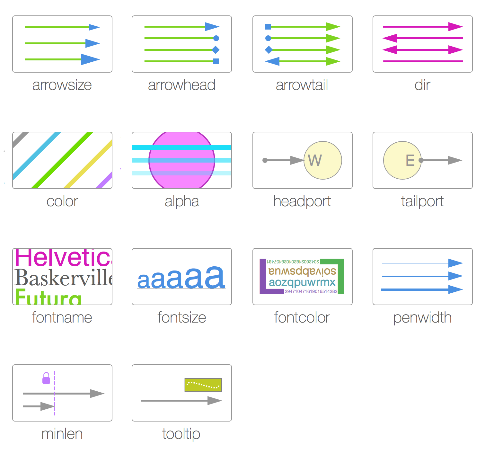
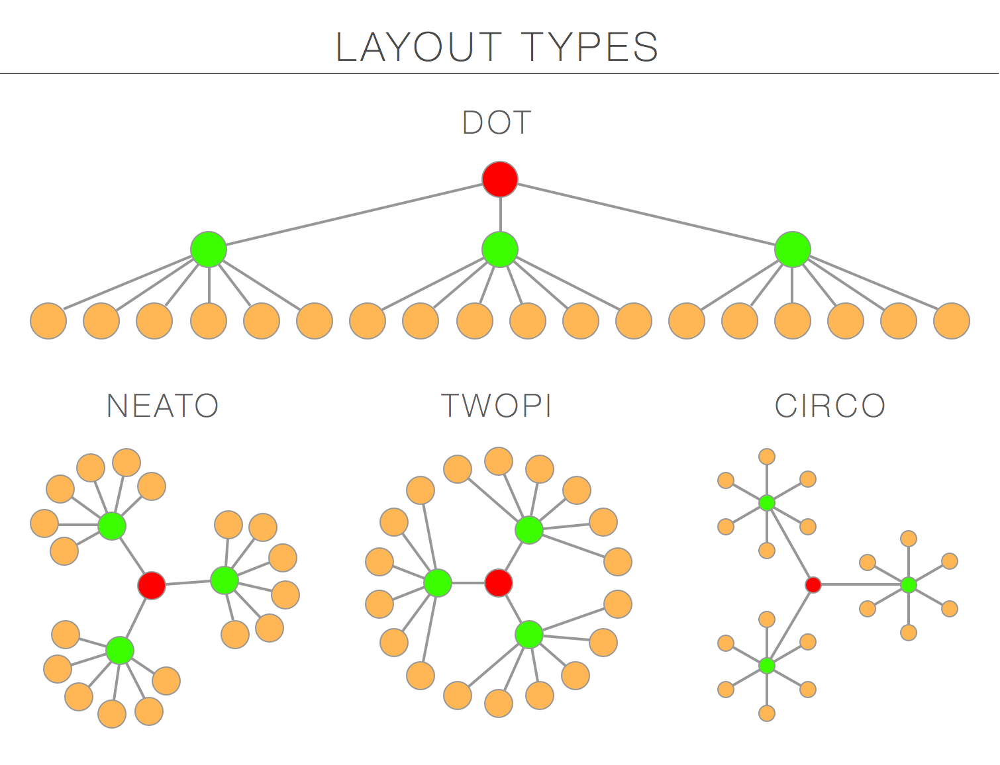
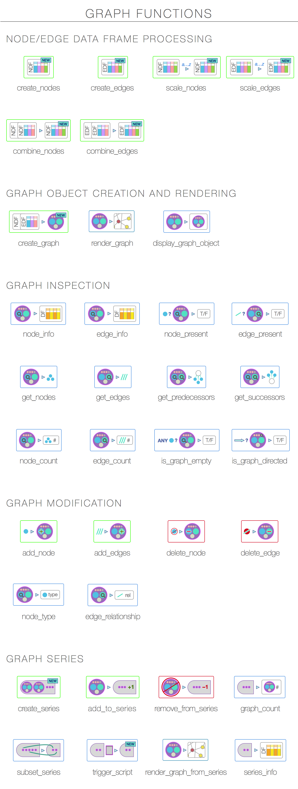
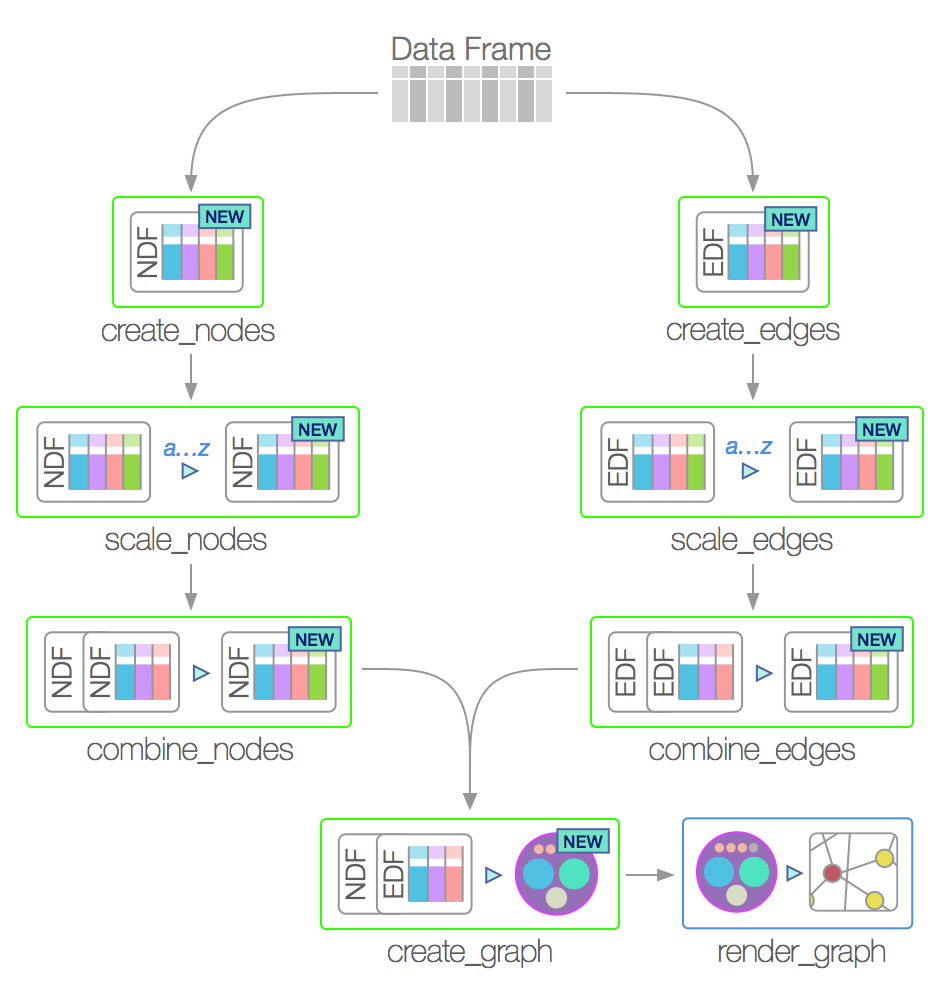

 [](http://issuestats.com/github/rich-iannone/DiagrammeR) [](http://issuestats.com/github/rich-iannone/DiagrammeR)

With the **DiagrammeR** package, you can create easily graph diagrams using **R**. You can either use **Markdown**-like text to describe and render a diagram, or, use a collection of functions to create graph objects from **R** objects and render/export at will. The output can be viewed in the **RStudio** Viewer, it can be incorporated in **R Markdown**, and it can be integrated in **shiny** web apps. Because we are doing this in **R** we can and always should add much more **R** code into the mix.

Go to the [**project website**](http://rich-iannone.github.io/DiagrammeR/) and view a video walkthrough for a graph diagram that's created with a few lines of text and is just as easily customizable. After being all fired up from that intense video-tutorial extravaganza, have a look at the [**DiagrammeR Docs**](http://rich-iannone.github.io/DiagrammeR/docs.html) to learn more.

## Creating Graphviz Graphs

It's possible to make single graph diagrams using the **Graphviz** support included in package. Simply specify a valid **Graphviz** graph in the **DOT** language either in the form of a string, a reference to a **Graphviz** file (with a **.gv** file extension), or as a text connection.

Here is an example where nodes (in this case styled as rectangles and circles) can be easily defined along with their connections:


```r
grViz("
digraph {
  
  # graph attributes
  graph [overlap = true]
  
  # node attributes
  node [shape = box,
        fontname = Helvetica,
        color = blue]
  
  # edge attributes
  edge [color = gray]
  
  # node statements
  A; B; C; D; E
  F [color = black]
  
  # node attributes
  node [shape = circle,
        fixedsize = true,
        width = 0.9]
  
  # node statements
  1; 2; 3; 4; 5; 6; 7; 8

  # edge statements
  A->1; B->2                   // gray
  B->3 [color = red]           // red
  B->4                         // gray
  C->A [color = green]         // green
  1->D; E->A; 2->4; 1->5; 1->F // gray
  E->6; 4->6; 5->7; 6->7       // gray
  3->8 [color = blue]          // blue
}
")
```

There is a great variety of ways to style the nodes and edges in a **Graphviz** graph diagram. Also, the layout of a graph can changed by using the **neato**, **twopi**, and **circo** rendering engines.









This only scratches the surface. At [DiagrammeR Docs](http://rich-iannone.github.io/DiagrammeR/graphviz.html), you can learn quite a lot more about this.

## Using DiagrammeR Functions to Define Graphs

In the last example you saw what was essentially a text string being passed into a single function. That's not very **R**-like, is it? Well, it's a good thing that there's a collection of graph functions available for creating and manipulating graphs (specifically, graph objects). They allow you to generate node and edge data frames (collections of nodes or edges along with their attributes), perform scaling of attribute values with data values, create graph objects, render those graphs, modify those graphs, get information from the graphs, create a series of graphs, and... so much more.



With the graph-building functions, it's possible to generate a graph with data available in a data frame. The general idea is to build specialized data frames for that contain either node data and attributes (node data frames) and those data frames that contain edge data and edge attributes (edge data frames). These data frames are permitted to have columns of arbitrary data alongside columns named for node or edge attributes. Because metadata can exist alongside the node and edge definitions, we can easily scale the values of the styling attributes and thus enable a highly visual means to differentiate nodes and edges by size, color, shape, opacity, length, etc.

Here is a simple workflow for building and rendering a graph object:



Want to learn more? Head over to the [**DiagrammeR Docs**](http://rich-iannone.github.io/DiagrammeR/graphs.html) to see plenty of examples and explanations.

## An Example with Data from the **nycflights13** Package

Using the `flights` dataset from the **nycflights13** **R** package, create a graph diagram. Here, the green lines show flights that weren't late arriving at their destinations (red indicates those late arrivals). Things to note are:

- the use of other packages to modify a data frame (because we are using **R**, after all)
- piped expressions with the `pipeR` package (the **DiagrammeR** functions are very pipe-able)
- the `circo` layout for the graph (it's a nice circular arrangement of nodes)


```r
# Get the latest build of the 'DiagrammeR' package from GitHub
devtools::install_github('rich-iannone/DiagrammeR')

library("DiagrammeR") 
library("nycflights13")
library("lubridate")
library("pipeR")
 
# Choose a day from 2013 for NYC flight data
# (You can choose any Julian day, it's interesting to see results for different days)
day_of_year <- 10 

# Get a data frame of complete cases (e.g., flights have departure and arrival times)
nycflights13 <-
  nycflights13::flights[which(complete.cases(nycflights13::flights) == TRUE), ]

# Generate a POSIXct vector of dates using the 'ISOdatetime' function
# Columns 1, 2, and 3 are year, month, and day columns
# Column 4 is a 4-digit combination of hours (00-23) and minutes (00-59)
date_time <-
  data.frame("date_time" =
               ISOdatetime(year = nycflights13[,1],
                           month = nycflights13[,2],
                           day = nycflights13[,3],
                           hour = gsub("[0-9][0-9]$", "", nycflights13[,4]),
                           min = gsub(".*([0-9][0-9])$", "\\1", nycflights13[,4]),
                           sec = 0, tz = "GMT"))

# Add the POSIXct vector 'date_time' to the 'nycflights13' data frame
nycflights13 <- cbind(date_time, nycflights13)

# Select flights only from the specified day of the year 2013
nycflights13_day <-
  subset(nycflights13,
         date_time >= ymd('2013-01-01', tz = "GMT") + days(day_of_year - 1) &
           date_time < ymd('2013-01-01', tz = "GMT") + days(day_of_year))

# Create the 'nodes' data frame where at least one column is named "nodes" or "node_id"
# Column 12 is the 3-letter code for the airport departing from
# Column 13 is for the airport arriving to
# (Option: change df to 'nycflights13_day' and only airports used for the day will be included)
nodes_df <- create_nodes(nodes = unique(c(nycflights13[,12],
                                    nycflights13[,13])),
                         label = FALSE)

# The 'edges' data frame must have columns named 'edge_from' and 'edge_to'
# The color attribute is determined with an 'ifelse' statement, where
# column 8 is the minutes early (negative values) or minutes late (positive values)
# for the flight arrival
edges_df <- create_edges(edge_from = nycflights13_day[,12],
                         edge_to = nycflights13_day[,13],
                         color = ifelse(nycflights13_day[,8] < 0,
                                    "green", "red"))

# Set the graph diagram's default attributes for...

# ...nodes
node_attrs <- c("style = filled", "fillcolor = lightblue",
                "color = gray", "shape = circle", "fontname = Helvetica",
                "width = 1")

# ...edges
edge_attrs <- c("arrowhead = dot")

# ...and the graph itself
graph_attrs <- c("layout = circo",
                 "overlap = false",
                 "fixedsize = true",
                 "ranksep = 3",
                 "outputorder = edgesfirst")

# Generate the graph diagram in the RStudio Viewer.
create_graph(nodes_df = nodes_df, edges_df = edges_df,
               graph_attrs = graph_attrs, node_attrs = node_attrs,
               edge_attrs = edge_attrs, directed = TRUE) %>>%
  render_graph(width = 1200, height = 800)
```

## Installation

If this package looks interesting then you'll want to install it for further testing.

**DiagrammeR** is used in an **R** environment. If you don't have an **R** installation, it can be obtained from the [**Comprehensive R Archive Network (CRAN)**](http://cran.rstudio.com). It is recommended that [**RStudio**](http://www.rstudio.com/products/RStudio/) be used as the **R** IDE to take advantage of its rendering capabilities and the code-coloring support for **Graphviz** and **mermaid** diagrams.

As for **DiagrammeR**, install the development version from GitHub using the **devtools** package.

```r
devtools::install_github('rich-iannone/DiagrammeR')
```

Or, get the v0.6 release from **CRAN**.

```r
install.packages('DiagrammeR')
```

