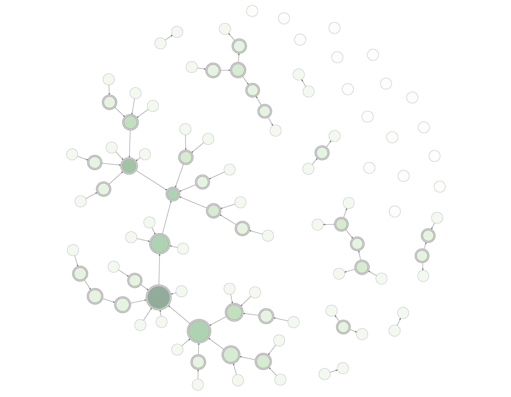
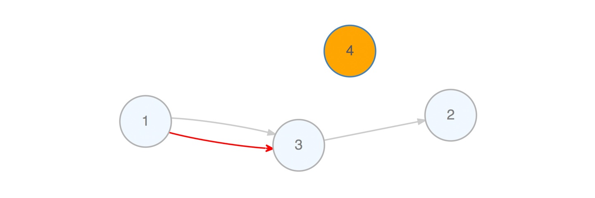
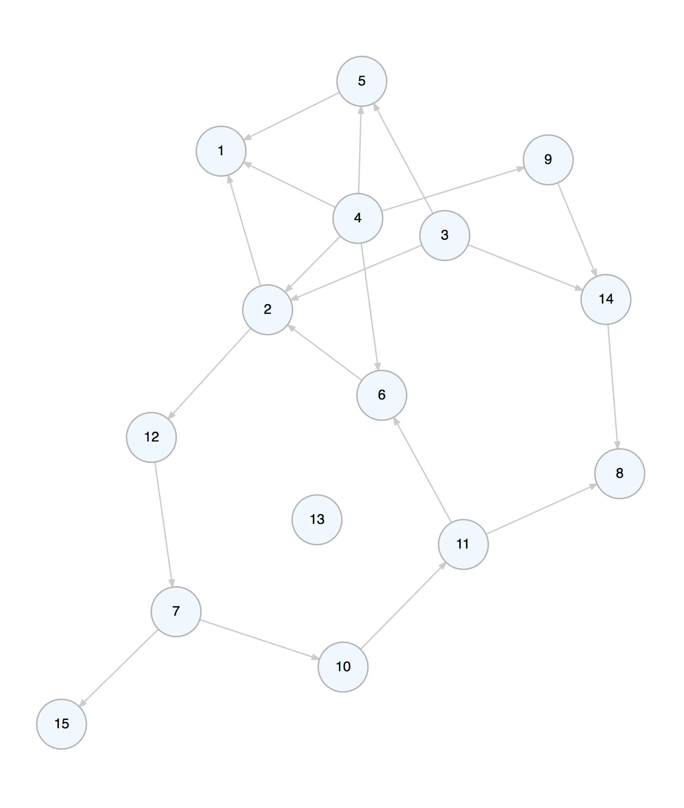
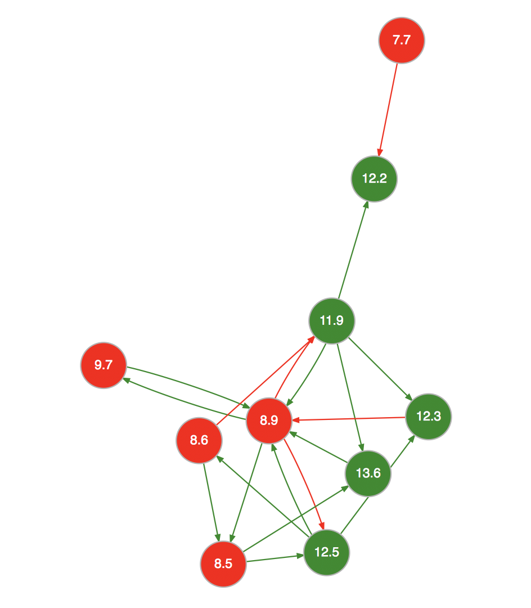
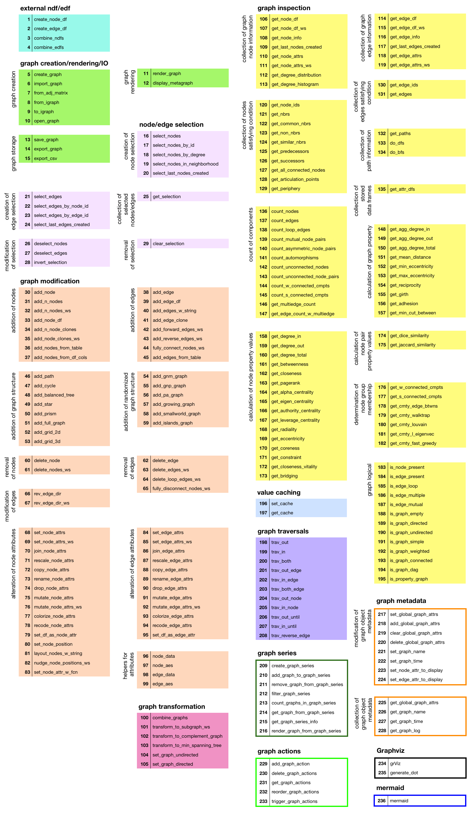
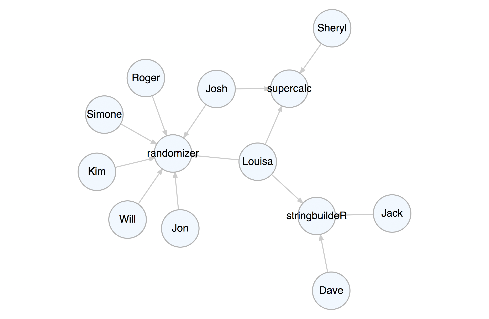
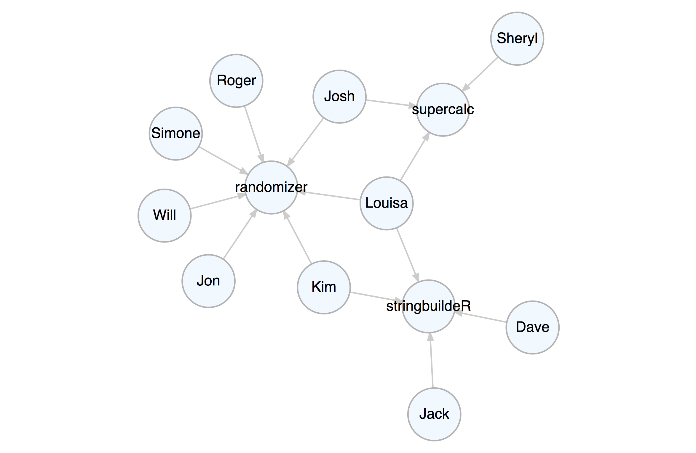

<!-- README.md is generated from README.Rmd. Please edit that file -->


[](https://travis-ci.org/rich-iannone/DiagrammeR)
[](https://codecov.io/github/rich-iannone/DiagrammeR?branch=master)
[](https://cran.r-project.org/package=DiagrammeR)


With the **DiagrammeR** package you can create, modify, analyze, and
visualize network graph diagrams. The output can be incorporated into
**RMarkdown** documents, integrated with **Shiny** web apps, converted
to other graph formats, or exported as image files.

This package is made possible by the
[**htmlwidgets**](http://www.htmlwidgets.org) R package, which provides
an easy-to-use framework for bringing together R and JavaScript.



The graph above can be created with this combination of **DiagrammeR**
functions:

``` r
library(DiagrammeR)

example_graph <-
  create_graph() %>%
  add_pa_graph(
    n = 50,
    m = 1,
    set_seed = 23) %>%
  add_gnp_graph(
    n = 50,
    p = 1/100,
    set_seed = 23) %>%
  join_node_attrs(
    df = get_betweenness(.)) %>%
  join_node_attrs(
    df = get_degree_total(.)) %>%
  colorize_node_attrs(
    node_attr_from = total_degree,
    node_attr_to = fillcolor,
    palette = "Greens",
    alpha = 90) %>%
  rescale_node_attrs(
    node_attr_from = betweenness,
    to_lower_bound = 0.5,
    to_upper_bound = 1.0,
      node_attr_to = height) %>%
  select_nodes_by_id(
    nodes = get_articulation_points(.)) %>%
  set_node_attrs_ws(
    node_attr = peripheries,
    value = 2) %>%
  set_node_attrs_ws(
    node_attr = penwidth,
    value = 3) %>%
  clear_selection() %>%
  set_node_attr_to_display(
    attr = NULL)
```

``` r
example_graph %>%
  render_graph(layout = "nicely")
```

**DiagrammeR**’s graph functions allow you to create graph objects,
modify those graphs, get information from the graphs, create a series of
graphs, and do many other useful things. This makes it possible to
generate a network graph with data available in tabular datasets. Two
specialized data frames contain node data and attributes (node data
frames) and edges with associated edge attributes (edge data frames).
Because the attributes are always kept alongside the node and edge
definitions (within the graph object itself), we can easily work with
them.

## Graph Basics

Let’s create a graph object with `create_graph()` and add some nodes and
edges to it. Each node gets a new integer ID upon creation. Each edge
also gets an ID starting from 1. The pipes between functions make the
whole process readable and understandable.

``` r
a_graph <-
  create_graph() %>%
  add_node() %>%
  add_node() %>%
  add_edge(
    from = 1,
    to = 2)
```


We can take away an edge by using `delete_edge()`.

``` r
b_graph <-
  a_graph %>%
  delete_edge(
    from = 1,
    to = 2)
```


We can add a node to the graph while, at the same time, defining edges
to or from existing nodes in the graph.

``` r
c_graph <-
  b_graph %>%
  add_node(
    from = 1,
    to = 2)
```


Viewing the graph object in the console will provide some basic
information about the graph and some pointers on where to get additional
information.

``` r
c_graph
#> DiagrammeR Graph // 3 nodes / 2 edges
#>   -- directed / connected / DAG / simple
#> 
#>   NODES / type: <unused> / label: <unused>            info: `get_node_df()`
#>     -- no additional node attributes
#>   EDGES / rel: <unused>                               info: `get_edge_df()`
#>     -- no additional edge attributes
#>   SELECTION / <none>
#>   CACHE / <none>
#>   STORED DFs / <none>
#>   GLOBAL ATTRS / 17 are set            info: `get_global_graph_attr_info()`
#>   GRAPH ACTIONS / <none>
#>   GRAPH LOG / <3 actions> -> add_edge() -> delete_edge() -> add_node()
```

Any time we add a node or edge to the graph, we can add node or edge
aesthetic or data attributes. These can be styling properties (e.g.,
`color`, `shape`), grouping labels (e.g., `type` and `rel`), or data
values that are useful for calculations and for display purposes. Most
node or edge creation functions (depending on whether they create either
edges, nodes, or both) have the arguments `node_aes`, `edge_aes`,
`node_data`, and `edge_data`. Using these, we can call the namesake
helper functions (`node_aes()`, `edge_aes()`, `node_data()`, and
`edge_data()`) to specifically target the created nodes or edges and
bind attribute data. An additional benefit in using the helper functions
(for the node/edge aesthetic attributes especially) is that RStudio can
provide inline help on attribute names and definitions when typing
`node_aes(` or `edge_aes(` and pressing the **TAB** key.

Here is an example of adding a node while setting its `color`,
`fillcolor`, and `fontcolor` node aesthetic attributes, and, adding an
edge with `color`, `arrowhead`, and `tooltip` edge aesthetic attributes.
In both the `add_node()` and the `add_edge()` calls, the new node and
edge were set with a `value` node/edge data attribute.

``` r
d_graph <-
  c_graph %>%
  add_node(
    type = "type_a",
    node_aes = node_aes(
      color = "steelblue",
      fillcolor = "lightblue",
      fontcolor = "gray35"),
    node_data = node_data(
      value = 2.5)) %>%
  add_edge(
    from = 1,
    to = 3,
    rel = "interacted_with",
    edge_aes = edge_aes(
      color = "red",
      arrowhead = "vee",
      tooltip = "Red Arrow"),
    edge_data = edge_data(
      value = 5.2))
```


Creating attributes and setting their values is often useful because we
can further work with the attributes (e.g., *mutate* values or even use
them during traversals). Furthermore, we can create aesthetic properties
based on numerical or categorical data. This is important for when you
want to display your graph diagram using the `render_graph()` function.

Don’t worry if attribute values weren’t set right during the creation of
the associated nodes or edges. They are ways to set attribute values for
existing nodes and edges. Functions are available for targeting the
specific nodes/edges (i.e., making a *selection*) and other functions
are used to set attribute values for the selected nodes or edges. Often,
this can be the more efficient strategy as we can target nodes/edges
based on their properties (e.g., degree, relationships to neighbors,
etc.). Here is an example where we select a node based on its `value`
attribute and modify its `color` node aesthetic attribute:

``` r
e_graph <-
  d_graph %>%
  select_nodes(
    conditions = 
      value == 2.5) %>%
  set_node_attrs_ws(
    node_attr = fillcolor,
    value = "orange") %>%
  clear_selection()
```

To explain this a bit, we take the graph object `d_graph`, select only
the nodes that have a node `value` attribute of exactly `2.5`. (We now
have an active node selection.) With the selected nodes, we set their
node attribute `fillcolor` with the value `orange`. Then we deactivate
the selection with `clear_selection()`. Now, if we view the graph with
`render_graph()` we get this:



There are quite a few functions that allow you to select nodes (e.g.,
`select_nodes()`, `select_nodes_by_id()`, `select_last_nodes_created()`)
and edges (e.g., `select_edges()`, `select_edges_by_edge_id()`,
`select_last_edges_created()`). With these selections, we can apply
changes using functions that end with `..._ws()` (with selection). As
seen, node attributes could be set/replaced with `set_node_attrs_ws()`
but we can also mutate attributes of selected nodes
(`mutate_node_attrs_ws()`), delete selected nodes (`delete_nodes_ws()`),
and even create a subgraph with that selection (`create_subgraph_ws()`).
Selections of nodes or edges can be inverted (where non-selected nodes
or edges become the active selection) with `invert_selection()`, certain
nodes/edges can be removed from the active selection with the
`deselect_nodes()`/`deselect_edges()`, and any selection can and should
be eventually cleared with `clear_selection()`.

We can create a graph object and add graph primitives such as paths,
cycles, and trees to it.

``` r
f_graph <-
  create_graph() %>%
  add_path(n = 3) %>%
  add_cycle(n = 4) %>%
  add_balanced_tree(
    k = 2, h = 2)
```


You can add one or more randomly generated graphs to a graph object.
Here, let’s add a directed GNM graph with 10 nodes and 15 edges (the
`set_seed` option makes the random graph reproducible).

``` r
g_graph <-
  create_graph() %>%
  add_gnm_graph(
    n = 15,
    m = 20,
    set_seed = 23)
```



The undirected version of this graph is can be made using:

``` r
h_graph <-
  create_graph(
    directed = FALSE) %>%
  add_gnm_graph(
    n = 15,
    m = 20,
    set_seed = 23)
```


We can view the graph using `render_graph()`. There are several layouts
to choose from as well (e.g., `nicely`, `tree`, `kk`, `fr`, etc.).

``` r
h_graph %>%
  render_graph(layout = "fr")
```


## Using Data from Tables to Generate a Graph

The **DiagrammeR** package contains a few simple datasets that help
illustrate how to create a graph with table data. The `node_list_1` and
`edge_list_1` datasets are super simple node and edge data frames that
can be assembled into a graph. Let’s print them side by side to see what
we’re working with.

    node_list_1     edge_list_1

``` 
   id label        from to 
1   1     A     1     1  2 
2   2     B     2     1  3 
3   3     C     3     1  4 
4   4     D     4     1  9 
5   5     E     5     2  8 
6   6     F     6     2  7 
7   7     G     7     2  1 
8   8     H     8     2 10 
9   9     I     9     3  1 
10 10     J     10    3  6 
                11    3  8
                12    4  1
                13    5  7
                14    6  2
                15    6  9
                16    8  1
                17    9  3
                18    9 10
                19   10  1
```

To fashion this into a graph, we need to ensure that both the nodes and
their attributes (in this case, just a `label`) are added, and, that the
edges are added. Furthermore, we must map the `from` and the `to`
definitions to the node `id` (in other cases, we may need to map
relationships between text labels to the same text attribute stored in
the node data frame). We can use three functions to generate a graph
containing this data:

1.  `create_graph()`
2.  `add_nodes_from_table()`
3.  `add_edges_from_table()`

Let’s show the process in a stepwise fashion (while occasionally viewing
the graph’s internal ndf and edf) so that we can understand what is
actually happening. First, create the graph object with
`create_graph()`:

``` r
# Create the graph object
i_graph_1 <-
  create_graph()
  
# It will start off as empty
i_graph_1 %>%
  is_graph_empty()
#> [1] TRUE
```

Add nodes from a table with `add_nodes_from_table()`:

``` r
# Add the nodes to the graph
i_graph_2 <-
  i_graph_1 %>%
  add_nodes_from_table(
    table = node_list_1,
    label_col = label)
```

Inspect the graph’s internal node data frame (ndf) with `get_node_df()`:

``` r
# View the graph's internal
# node data frame
i_graph_2 %>%
  get_node_df()
#>    id type label id_external
#> 1   1 <NA>     A           1
#> 2   2 <NA>     B           2
#> 3   3 <NA>     C           3
#> 4   4 <NA>     D           4
#> 5   5 <NA>     E           5
#> 6   6 <NA>     F           6
#> 7   7 <NA>     G           7
#> 8   8 <NA>     H           8
#> 9   9 <NA>     I           9
#> 10 10 <NA>     J          10
```

The graph now has 10 nodes (no edges yet). Each node was automatically
assigned an auto-incrementing `id`. The incoming `id` was also
automatically renamed `id_external` so as to avoid duplicate column
names and also to retain a column for mapping edge definitions. Now,
let’s add the edges. We need to specify that the `from_col` in the
`edge_list_1` table is indeed `from` and that the `to_col` is `to`. The
`from_to_map` argument expects a node attribute column that the `from`
and `to` columns will map to. In this case it’s `id_external`. Note that
while `id` also matches perfectly in this mapping, there may be cases
where `id` won’t match with and `id_external` column (e.g., when there
are existing nodes or when the node `id` values in the incoming table
are provided in a different order, etc.).

Now, connect the graph nodes with edges from another dataset using
`add_edges_from_table()`:

``` r
# Add the edges to the graph
i_graph_3 <-
  i_graph_2 %>%
  add_edges_from_table(
    table = edge_list_1,
    from_col = from,
    to_col = to,
    from_to_map = id_external)
```

Inspect the graph’s internal edge data frame (edf) with `get_edge_df()`:

``` r
# View the edge data frame
i_graph_3 %>%
  get_edge_df()
#>    id from to  rel
#> 1   1    1  2 <NA>
#> 2   2    1  3 <NA>
#> 3   3    1  4 <NA>
#> 4   4    1  9 <NA>
#> 5   5    2  8 <NA>
#> 6   6    2  7 <NA>
#> 7   7    2  1 <NA>
#> 8   8    2 10 <NA>
#> 9   9    3  1 <NA>
#> 10 10    3  6 <NA>
#> 11 11    3  8 <NA>
#> 12 12    4  1 <NA>
#> 13 13    5  7 <NA>
#> 14 14    6  2 <NA>
#> 15 15    6  9 <NA>
#> 16 16    8  1 <NA>
#> 17 17    9  3 <NA>
#> 18 18    9 10 <NA>
#> 19 19   10  1 <NA>
```

By supplying the name of the graph object in the console, we can get a
succinct summary of the graph’s properties. Here, we see that the graph
has 10 nodes and 19 edges:

``` r
i_graph_3
#> DiagrammeR Graph // 10 nodes / 19 edges
#>   -- directed / connected / simple
#> 
#>   NODES / type: <unused> / label: 10 vals - complete & unique
#>     -- 1 additional node attribute (id_external)
#>   EDGES / rel: <unused>                               info: `get_edge_df()`
#>     -- no additional edge attributes
#>   SELECTION / <none>
#>   CACHE / <none>
#>   STORED DFs / <none>
#>   GLOBAL ATTRS / 17 are set            info: `get_global_graph_attr_info()`
#>   GRAPH ACTIONS / <none>
#>   GRAPH LOG / <1 action> -> add_nodes_from_table() -> add_edges_from_table() -> ()
```

There are two other similar datasets included in the package
(`node_list_2` and `edge_list_2`). These contain extended attribute
data. Let’s have a quick look at their column names:

``` r
node_list_2 %>% colnames()
#> [1] "id"      "label"   "type"    "value_1" "value_2"
```

``` r
edge_list_2 %>% colnames()
#> [1] "from"    "to"      "rel"     "value_1" "value_2"
```

Because we have unique labels in the `label` column, and categorical
labels in the `type` and `rel` columns, we can create a property graph
from this data. Like before, we can incorporate the two tables as a
graph with `add_nodes_from_table()` and `add_edges_from_table()`. This
time, we’ll remove the auto-generated `id_external` node attribute with
the `drop_node_attrs()` function.

``` r
j_graph <- 
  create_graph() %>% 
  add_nodes_from_table(
    table = node_list_2,
    label_col = label,
    type_col = type) %>%
  add_edges_from_table(
    table = edge_list_2,
    from_col = from,
    to_col = to,
    from_to_map = id_external,
    rel_col = rel) %>%
  drop_node_attrs(
    node_attr = id_external)
```

Let’s again view the graph summary in the console. Note that the
additional node attributes (`value_1` and `value_2`) are present for
both the nodes and the edges:

``` r
j_graph
#> DiagrammeR Graph // 10 nodes / 19 edges
#>   -- directed / connected / property graph / simple
#> 
#>   NODES / type: 2 vals - complete / label: 10 vals - complete & unique
#>     -- 2 additional node attributes (value_1, value_2)
#>   EDGES / rel: 3 vals - complete                      info: `get_edge_df()`
#>     -- 2 additional edge attributes (value_1, value_2)
#>   SELECTION / <none>
#>   CACHE / <none>
#>   STORED DFs / <none>
#>   GLOBAL ATTRS / 17 are set            info: `get_global_graph_attr_info()`
#>   GRAPH ACTIONS / <none>
#>   GRAPH LOG / <3 actions> -> add_edges_from_table() -> () -> drop_node_attrs()
```

Now, because we have node/edge metadata (categorical labels and
numerical data in `value_1` & `value_2` for both nodes and edges), we
can do some interesting things with the graph. First, let’s do some
mutation with `mutate_node_attrs()` and `mutate_edge_attrs()` and get
the sums of `value_1` and `value_2` as `value_3` (for both the nodes and
the edges). Then, let’s color the nodes and edges `forestgreen` if
`value_3` is greater than `10` (`red` otherwise). Finally, let’s display
the values of `value_3` for the nodes when rendering the graph diagram.
Here we go\!

``` r
k_graph <-
  j_graph %>%
  mutate_node_attrs(
    value_3 = value_1 + value_2) %>%
  mutate_edge_attrs(
    value_3 = value_1 + value_2) %>%
  select_nodes(
    conditions = value_3 > 10) %>%
  set_node_attrs_ws(
    node_attr = fillcolor,
    value = "forestgreen") %>%
  invert_selection() %>%
  set_node_attrs_ws(
    node_attr = fillcolor,
    value = "red") %>%
  select_edges(
    conditions = value_3 > 10) %>%
  set_edge_attrs_ws(
    edge_attr = color,
    value = "forestgreen") %>%
  invert_selection() %>%
  set_edge_attrs_ws(
    edge_attr = color,
    value = "red") %>%
  clear_selection() %>%
  set_node_attr_to_display(
    attr = value_3)
```

``` r
k_graph %>% render_graph()
```



## Functions in the Package

There are a lot of functions for working with graphs. If you need help
with any given function, try `help([function_name])`. Each function is
well documented, with explanations for each argument and many usage
examples.



## A Network Graph Example

Let’s create a property graph that pertains to contributors to three
software projects. This graph has nodes representing people and
projects. The attributes `name`, `age`, `join_date`, `email`,
`follower_count`, `following_count`, and `starred_count` are specific to
the `person` nodes while the `project`, `start_date`, `stars`, and
`language` attributes apply to the `project` nodes. The edges represent
the relationships between the people and the project.

The example graph file `repository.dgr` is available in the
`extdata/example_graphs_dgr/` directory in the **DiagrammeR** package
(currently, only for the **Github** version). We can load it into memory
by using the `open_graph()` function, where `system.file()` helps to
provide the location of the file within the package.

``` r
library(DiagrammeR)

# Load in a the small repository graph
graph <-
  open_graph(
    system.file(
      "extdata/example_graphs_dgr/repository.dgr",
      package = "DiagrammeR"))
```

We can always view this property graph with the `render_graph()`
function:

``` r
render_graph(graph, layout = "kk")
```



Now that the graph is set up, you can create queries with **magrittr**
pipelines to get specific answers from the graph.

Get the average age of all the contributors. Select all nodes of type
`person` (not `project`). Each node of that type has non-`NA` `age`
attribute, so, get that attribute as a vector with `get_node_attrs_ws()`
and then calculate the mean with R’s `mean()` function.

``` r
graph %>% 
  select_nodes(
    conditions = type == "person") %>%
  get_node_attrs_ws(
    node_attr = age) %>%
  mean()
#> [1] 33.6
```

We can get the total number of commits to all projects. We know that all
edges contain the numerical `commits` attribute, so, select all edges
(`select_edges()` by itself selects all edges in the graph). After that,
get a numeric vector of `commits` values and then get its `sum()` (all
commits to all projects).

``` r
graph %>% 
  select_edges() %>%
  get_edge_attrs_ws(
    edge_attr = commits) %>%
  sum()
#> [1] 5182
```

Single out the one known as Josh and get his total number of commits as
a maintainer and as a contributor. Start by selecting the Josh node with
`select_nodes(conditions = name == "Josh")`. In this graph, we know that
all people have an edge to a project and that edge can be of the
relationship (`rel`) type of `contributor` or `maintainer`. We can
migrate our selection from nodes to outbound edges with
`trav_out_edges()` (and we won’t provide a condition, just all the
outgoing edges from Josh will be selected). Now we have a selection of 2
edges. Get that vector of `commits` values with `get_edge_attrs_ws()`
and then calculate the `sum()`. This is the total number of commits.

``` r
graph %>% 
  select_nodes(
    conditions = name == "Josh") %>%
  trav_out_edge() %>%
  get_edge_attrs_ws(
    edge_attr = commits) %>%
  sum()
#> [1] 227
```

Get the total number of commits from Louisa, just from the maintainer
role though. In this case we’ll supply a condition in `trav_out_edge()`.
This acts as a filter for the traversal and this means that the
selection will be applied to only those edges where the condition is
met. Although there is only a single value, we’ll still use `sum()`
after `get_edge_attrs_ws()` (a good practice because we may not know the
vector length, especially in big graphs).

``` r
graph %>% 
  select_nodes(
    conditions = name == "Louisa") %>%
  trav_out_edge(
    conditions = rel == "maintainer") %>%
  get_edge_attrs_ws(
    edge_attr = commits) %>%
  sum()
#> [1] 236
```

How do we do something more complex, like, get the names of people in
graph above age 32? First, select all `person` nodes with
`select_nodes(conditions = type == "person")`. Then, follow up with
another `select_nodes()` call specifying `age > 32`. Importantly, have
`set_op = "intersect"` (giving us the intersection of both selections).

Now that we have the starting selection of nodes we want, we need to get
all values of these nodes’ `name` attribute as a character vector. We do
this with the `get_node_attrs_ws()` function. After getting that vector,
sort the names alphabetically with the R function `sort()`. Because we
get a named vector, we can use `unname()` to not show us the names of
each vector component.

``` r
graph %>% 
  select_nodes(
    conditions = type == "person") %>%
  select_nodes(
    conditions = age > 32,
    set_op = "intersect") %>%
  get_node_attrs_ws(
    node_attr = name) %>%
  sort() %>%
  unname()
#> [1] "Jack"   "Jon"    "Kim"    "Roger"  "Sheryl"
```

That **supercalc** project is progressing quite nicely. Let’s get the
total number of commits from all people to that most interesting
project. Start by selecting that project’s node and work backwards.
Traverse to the edges leading to it with `trav_in_edge()`. Those edges
are from committers and they all contain the `commits` attribute with
numerical values. Get a vector of `commits` and then get the sum (there
are `1676` commits).

``` r
graph %>% 
  select_nodes(
    conditions = project == "supercalc") %>%
  trav_in_edge() %>%
  get_edge_attrs_ws(
    edge_attr = commits) %>%
  sum()
#> [1] 1676
```

Kim is now a contributor to the **stringbuildeR** project and has made
15 new commits to that project. We can modify the graph to reflect this.

First, add an edge with `add_edge()`. Note that `add_edge()` usually
relies on node IDs in `from` and `to` when creating the new edge. This
is almost always inconvenient so we can instead use node labels (we know
they are unique in this graph) to compose the edge, setting `use_labels
= TRUE`.

The `rel` value in `add_edge()` was set to `contributor` – in a property
graph we always have values set for all node `type` and edge `rel`
attributes. We will set another attribute for this edge (`commits`) by
first selecting the edge (it was the last edge made, so we can use
`select_last_edges_created()`), then, use `set_edge_attrs_ws()` and
provide the attribute/value pair. Finally, clear the active selections
with `clear_selection()`. The graph is now changed, have a look.

``` r
graph <- 
  graph %>%
  add_edge(
    from = "Kim",
    to = "stringbuildeR",
    rel = "contributor") %>%
  select_last_edges_created() %>%
  set_edge_attrs_ws(
    edge_attr = commits,
    value = 15) %>%
  clear_selection()
```

``` r
render_graph(graph, layout = "kk")
```



Get all email addresses for contributors (but not maintainers) of the
**randomizer** and **supercalc88** projects. With `trav_in_edge()` we
just want the `contributer` edges/commits. Once on those edges, hop back
unconditionally to the people from which the edges originate with
`trav_out_node()`. Get the `email` values from those selected
individuals as a sorted character vector.

``` r
graph %>% 
  select_nodes(
    conditions = 
      project == "randomizer" | 
      project == "supercalc") %>%
  trav_in_edge(
    conditions = rel == "contributor") %>%
  trav_out_node() %>%
  get_node_attrs_ws(
    node_attr = email) %>%
  sort() %>%
  unname()
#> [1] "j_2000@ultramail.io"      "josh_ch@megamail.kn"     
#> [3] "kim_3251323@ohhh.ai"      "lhe99@mailing-fun.com"   
#> [5] "roger_that@whalemail.net" "the_simone@a-q-w-o.net"  
#> [7] "the_will@graphymail.com"
```

Which people have committed to more than one project? This is a matter
of node degree. We know that people have edges outward and projects and
edges inward. Thus, anybody having an outdegree (number of edges
outward) greater than `1` has committed to more than one project.
Globally, select nodes with that condition using
`select_nodes_by_degree("outdeg > 1")`. Once getting the `name`
attribute values from that node selection, we can provide a sorted
character vector of names.

``` r
graph %>%
  select_nodes_by_degree(
    expressions = "outdeg > 1") %>%
  get_node_attrs_ws(
    node_attr = name) %>%
  sort() %>%
  unname()
#> [1] "Josh"   "Kim"    "Louisa"
```

## Installation

**DiagrammeR** is used in an R environment. If you don’t have an R
installation, it can be obtained from the [**Comprehensive R Archive
Network (CRAN)**](https://cran.r-project.org/).

You can install the development version of **DiagrammeR** from
**GitHub** using the **devtools** package.

``` r
devtools::install_github("rich-iannone/DiagrammeR")
```

Or, get it from **CRAN**.

``` r
install.packages("DiagrammeR")
```

If you encounter a bug, have usage questions, or want to share ideas to
make this package better, feel free to file an
[issue](https://github.com/rich-iannone/DiagrammeR/issues).

## Code of Conduct

[Contributor Code of
Conduct](https://github.com/rich-iannone/DiagrammeR/blob/master/CONDUCT.md).
By participating in this project you agree to abide by its terms.

## License

MIT © Richard Iannone
